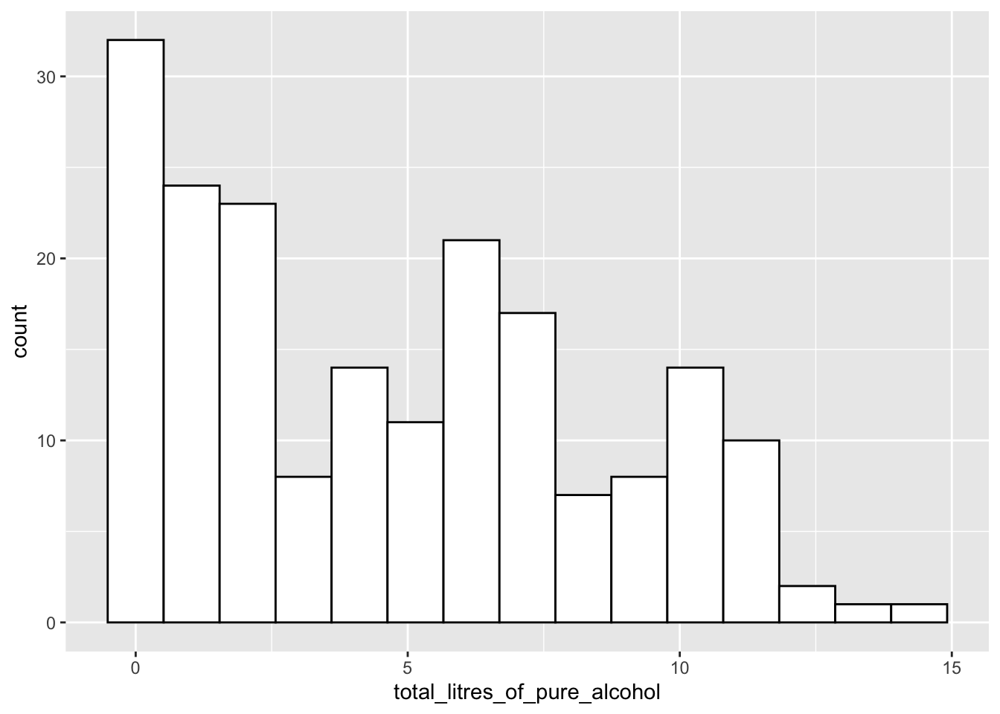

# Getting Started with `R` and `R Studio` {#intro}

__Goals__:

1. Use `R Studio` on the server

2. Use `R Markdown` and code chunks

3. Load in data to `R Studio`

4. Run code and change a few things within that code

5. Correct some common errors when running code in `R`

## Intro to `R` and `R Studio`

`R` is a statistical computing software used by many statisticians as well as professionals in other fields, such as biology, ecology, business, and psychology. The goal of Week 0 is to provide basic familiarity with `R` and `R Markdown`, which we will be using for the entire semester.

Open `R Studio` on the SLU `R Studio` server at
<a href="http://rstudio.stlawu.local:8787" target="_blank">http://rstudio.stlawu.local:8787</a> and create a folder called STAT_234 or some other meaningful title to you. Note that you must be on campus to use the `R Studio` server, unless you use a VPN. Directions on how to set-up VPN are
<a href="https://infotech.stlawu.edu/support/content/11269" target="_blank">https://infotech.stlawu.edu/support/content/11269 </a>
<> for Macs and <a href="https://stlawu.teamdynamix.com/TDClient/1805/Portal/KB/ArticleDet?ID=55118" target="_blank">https://stlawu.teamdynamix.com/TDClient/1805/Portal/KB/ArticleDet?ID=55118 </a> for Windows.

Next, create a subfolder within your STAT_234 folder. Title it _Notes_ (or whatever you want really). 

Then, create an `R Project` by Clicking File -> New Project -> Existing  Directory,  navigate to the _Notes_ folder, and click _Create Project_. 

Within this folder, click the _New Folder_ button in your bottom-left window and name a new folder _data_. Then, download the data.zip file from Sakai (in Resources). Upload that file in to the server by clicking "Upload" in the bottom right panel. In the dialog box that appears, you can click "Choose File" and navigate to the folder where you saved the zip file (probably Downloads by default). The zip file will automatically expand once uploaded. It includes data sets that we will use throughout the course.

Finally, we want to create a new `R Markdown` file by clicking File -> New File -> `R Markdown`. You can give your new `R Markdown` file a title if you want, and then click okay.

Before moving on, click the **Knit** button in the top-left window at the top of the menu bar (look for the knitting needle icon). Make sure that the file knits to a pretty-looking .html file. The newly knitted .html file can now be found in your folder with your `R` project.

## What are `R`, `R Studio`, and `R Markdown`?

The distinction between the 3 will become more clear later on. For now, 
* `R` is a statistical coding software used heavily for data analysis and statistical procedures.

* `R Studio` is a nice IDE (Integrated Development Environment) for `R` that has a lot of convenient features. Think of this as just a convenient User Interface.

* `R Mardkown` allows users to mix regular Microsoft-Word-style text with code. The `.Rmd` file ending denotes an `R Mardkown` file. `R Markdown` has many options that we will use heavily throughout the semester, but there's no need to worry about these now.

### `R` Packages and the `tidyverse`

You can think of `R` packages as add-ons to `R` that let you do things that `R` on its own would not be able to do. If you're in to video games, you can think of `R` packages as extra Downloadable Content (DLC). But, unlike most gaming DLC, `R` packages are always free and we will make very heavy use of `R` packages.

The `tidyverse` is a series of `R` packages that are useful for data science. In the order that we will encounter them in this class, the core `tidyverse` packages are:

1. `ggplot2` for plotting data
2. `dplyr` for data wrangling and summarizing
3. `tidyr` for data tidying and reshaping
4. `readr` for data import
5. `tibble` for how data is stored
6. `stringr` for text data
7. `forcats` for factor (categorical) data
8. `purrr`, for functional programming, the only one of these core 8 that we won't get to use

We will use packages outside of the core `tidyverse` as well, but the `tidyverse` is the main focus. 

We are going to change one option before proceeding. In the top file menu, click Tools -> Global Options -> R Markdown and then uncheck the box that says "Show output inline for all R Markdown documents". Don't worry about this for now, but changing this option just means that code results will appear in the bottom-left window and graphs will appear in the bottom-right window of `R Studio`.

## Putting Code in a `.Rmd` File

The first thing that we will do that involves code is to load a package into `R` with the `library()` function. A package is just an `R` add-on that lets you do more than you could with just `R` on its own. Load the `tidyverse` package into `R` by typing and running the `library(tidyverse)` line. To create a code chunk, click _Insert_ -> `R`. Within this code chunk, type in `library(tidyverse)` and run the code by either

1. Clicking the "Run" button in the menu bar of the top-left window of `R Studio` or

2. (Recommended) Clicking "Command + Enter" on a Mac or "Control + Enter" on a PC.

Note that all code appears in grey boxes surrounded by three backticks while normal text has a different colour background with no backticks.


```r
library(tidyverse)
```

```
## ── Attaching packages ─────────────────────────────────────── tidyverse 1.3.0 ──
```

```
## ✓ ggplot2 3.3.3     ✓ purrr   0.3.4
## ✓ tibble  3.1.1     ✓ dplyr   1.0.4
## ✓ tidyr   1.1.2     ✓ stringr 1.4.0
## ✓ readr   1.3.1     ✓ forcats 0.5.0
```

```
## ── Conflicts ────────────────────────────────────────── tidyverse_conflicts() ──
## x dplyr::filter() masks stats::filter()
## x dplyr::lag()    masks stats::lag()
```

When you run the following line, some text will appear in the bottom-left window. We won't worry too much about what this text means now, but we also won't ignore it completely. You should be able to spot the 8 core `tidyverse` packages listed above as well as some numbers that follow each package. The numbers correspond to the package version. There's some other things too, but as long as this text does not start with "Error:", you're good to go!

Congrats on running your first line of code for this class! This particular code isn't particularly exciting because it doesn't really do anything that we can see.

We have run `R` code using an `R` chunk. In your `R` chunk, on a new line, try typing in a basic calculation, like `71 + 9` or `4 / 3`, them run the line and observe the result. 

So, that still wasn't super exciting. `R` can perform basic calculations, but you could just use a calculator or Excel for that. In order to look at things that are a bit more interesting, we need some data.

## Alcohol Data Example

We will be looking at two data sets just to get a little bit of a preview of things we will be working on for the rest of the semester. __Important__: Do not worry about understanding what the following code is doing at this point. There will be plenty of time to understand this in the weeks ahead. The purpose of this section is just to get used to using `R`: there will be more detailed explanations and exercises about the functions used and various options in the coming weeks. In particular, the following code uses the `ggplot2`, `dplyr`, and `tidyr` packages, which we will cover in detail throughout the first ~ 3-4 weeks of this course.

Data for this first part was obtained from fivethirtyeight at <a href="https://github.com/fivethirtyeight/data/tree/master/alcohol-consumption" target="_blank">Five Thirty Eight GitHub page</a>.

The first step is to read the data set into `R`. Though you have already downloaded alcohol.csv in the data zip, we still need to load it into `R`. Check to make sure the alcohol.csv is in the data folder in your bottom-right hand window. The following code can be copied to an `R` code chunk to read in the data:


```r
read_csv("data/alcohol.csv")
```

Note that we do not need the full file extension __if__ we have the data set in an `R` project. 

Did something show up in your console window? If so, great! If not, make sure that the data set is in the data folder and that you have an `R` project set up.

We would like to name our data set something so that we could easily reference it later, so name your data set using the `<-` operator, as in


```r
alcohol_data <- read_csv("data/alcohol.csv")
```

You can name your data set whatever you want to (with a few restrictions). I've named it `alcohol_data`. Now, if you run the line of code above where you name the data set, and run `alcohol_data`, you should see the data set appear:


```r
alcohol_data
```

```
## # A tibble: 193 x 5
##    country      beer_servings spirit_servings wine_servings total_litres_of_pur…
##    <chr>                <dbl>           <dbl>         <dbl>                <dbl>
##  1 Afghanistan              0               0             0                  0  
##  2 Albania                 89             132            54                  4.9
##  3 Algeria                 25               0            14                  0.7
##  4 Andorra                245             138           312                 12.4
##  5 Angola                 217              57            45                  5.9
##  6 Antigua & B…           102             128            45                  4.9
##  7 Argentina              193              25           221                  8.3
##  8 Armenia                 21             179            11                  3.8
##  9 Australia              261              72           212                 10.4
## 10 Austria                279              75           191                  9.7
## # … with 183 more rows
```

What's in this data set? We see a few _variables_ on the columns:

* `country`: the name of the country
* `beer_servings`: the average number of beer servings per person per year
* `spirit_servings`: the average number of spirit (hard alcohol) servings per person per year
* `wine_servings`: the average number of wine servings per person per year
* `total_litres_of_pure_alcohol`: the average total litres of pure alcohol consumed per person per year.

One goal of this class is for you to be able to pose questions about a data set and then use the tools we will learn to answer those questions. For example, we might want to know what the distribution of total litres of alcohol consumed per person looks like across countries. To do this, we can make a plot with the `ggplot2` package, one of the packages that automatically loads with `tidyverse`. We might start by constructing the following plot. __Reminder__: the goal of this is not for everyone to understand the code in this plot, so don't worry too much about that. 


```r
ggplot(data = alcohol_data,
       mapping = aes(total_litres_of_pure_alcohol)) +
  geom_histogram(colour = "black", fill = "white", bins = 15)
```



I now want to see where the United States (`USA`) falls on this distribution by drawing a red vertical line for the total litres of alcohol consumed in the United States. To do so, I'll first use the `filter()` function in the `dplyr` package (again, we will learn about that function in detail later). Copy and paste the following lines of code into a new `R` chunk. Then, run the lines.


```r
small_df <- alcohol_data %>% filter(country == "USA")
ggplot(data = alcohol_data,
       mapping = aes(total_litres_of_pure_alcohol)) +
  geom_histogram(colour = "black", fill = "white", bins = 15) +
  geom_vline(data = small_df,
             aes(xintercept = total_litres_of_pure_alcohol),
             colour = "red")
```


It looks like there are some countries that consume little to no alcohol. We might want to know what these countries are: 


```r
alcohol_data %>% filter(total_litres_of_pure_alcohol == 0)
```

```
## # A tibble: 13 x 5
##    country     beer_servings spirit_servings wine_servings total_litres_of_pure…
##    <chr>               <dbl>           <dbl>         <dbl>                 <dbl>
##  1 Afghanistan             0               0             0                     0
##  2 Bangladesh              0               0             0                     0
##  3 North Korea             0               0             0                     0
##  4 Iran                    0               0             0                     0
##  5 Kuwait                  0               0             0                     0
##  6 Libya                   0               0             0                     0
##  7 Maldives                0               0             0                     0
##  8 Marshall I…             0               0             0                     0
##  9 Mauritania              0               0             0                     0
## 10 Monaco                  0               0             0                     0
## 11 Pakistan                0               0             0                     0
## 12 San Marino              0               0             0                     0
## 13 Somalia                 0               0             0                     0
```

It looks like there are 13 countries in the data set that consume no alcohol. Note that, in the chunk above, we have to use in `total_litres_of_pure_alcohol` as the variable name because this is the name of the variable in the data set. Even something like spelling litres in the American English liters (`total_liters_of_pure_alcohol`) would throw an error because this isn't the exact name of the variable in the data set. This is something that can be very aggravating when you are first learning any coding language. 

Now suppose that we want to know the 3 countries that consume the most beer, the 3 countries that consume the most spirits, and the 3 countries that consume the most wine per person. If you're a trivia person, you can form some guesses. Without cheating, I am going to guess (Germany, USA, and UK) for beer, (Spain, Italy, and USA) for wine, and (Russia, Poland, and Lithuania) for spirits. Let's do beer first!


```r
alcohol_data %>% mutate(rankbeer = rank(desc(beer_servings))) %>%
  arrange(rankbeer) %>% 
  filter(rankbeer <= 3)
```

```
## # A tibble: 3 x 6
##   country  beer_servings spirit_servings wine_servings total_litres_of… rankbeer
##   <chr>            <dbl>           <dbl>         <dbl>            <dbl>    <dbl>
## 1 Namibia            376               3             1              6.8        1
## 2 Czech R…           361             170           134             11.8        2
## 3 Gabon              347              98            59              8.9        3
```

Let's do the same thing for Wine and Spirits:


```r
alcohol_data %>% mutate(rankwine = rank(desc(wine_servings))) %>%
  arrange(rankwine) %>% 
  filter(rankwine <= 3)
```

```
## # A tibble: 3 x 6
##   country  beer_servings spirit_servings wine_servings total_litres_of… rankwine
##   <chr>            <dbl>           <dbl>         <dbl>            <dbl>    <dbl>
## 1 France             127             151           370             11.8        1
## 2 Portugal           194              67           339             11          2
## 3 Andorra            245             138           312             12.4        3
```

```r
alcohol_data %>% mutate(rankspirits = rank(desc(spirit_servings))) %>%
  arrange(rankspirits) %>% 
  filter(rankspirits <= 3)
```

```
## # A tibble: 2 x 6
##   country beer_servings spirit_servings wine_servings total_litres_of_pure_alco…
##   <chr>           <dbl>           <dbl>         <dbl>                      <dbl>
## 1 Grenada           199             438            28                       11.9
## 2 Belarus           142             373            42                       14.4
## # … with 1 more variable: rankspirits <dbl>
```

Finally, suppose that I want to know which country consumes the most wine relative to their beer consumption? Let's first look at this question graphically. I need to tidy the data first with the `pivot_longer()` function from the `tidyr` package:


```r
alcohol_long <- alcohol_data %>% pivot_longer(c(beer_servings, wine_servings),
  names_to = "type", values_to = "litres_per_person")

onecountry_df <- alcohol_long %>% 
  filter(country == "Denmark")
ggplot(data = alcohol_long, mapping = aes(x = type, y = litres_per_person,
    group = country)) + 
  geom_line(alpha = 0.3) +
  geom_line(data = onecountry_df,
    colour = "purple", size = 1.5)
```


We could do much better than this fairly ugly plot, and it's missing a legend telling us that the purple line corresponds to Denmark, the country at the top of my "must visit" list. The left corresponds to beer servings while the right corresponds to wine servings so a line that has a positive slope corresponds to a country that consumes more wine than beer. We will get into that stuff later: for now, copy the code chunk and change the highlighted line so that it corresponds to a country that interests you (other than Denmark). 

We might be able to better answer the original question numerically by computing the wine to beer ratio for each country and then ordering from the largest ratio to the smallest ratio:


```r
alcohol_data %>%
  mutate(wbratio = wine_servings / beer_servings) %>%
  arrange(desc(wbratio)) %>%
  select(country, beer_servings, wine_servings, wbratio)
```

```
## # A tibble: 193 x 4
##    country             beer_servings wine_servings wbratio
##    <chr>                       <dbl>         <dbl>   <dbl>
##  1 Cook Islands                    0            74  Inf   
##  2 Qatar                           1             7    7   
##  3 Montenegro                     31           128    4.13
##  4 Timor-Leste                     1             4    4   
##  5 Syria                           5            16    3.2 
##  6 France                        127           370    2.91
##  7 Georgia                        52           149    2.87
##  8 Italy                          85           237    2.79
##  9 Equatorial Guinea              92           233    2.53
## 10 Sao Tome & Principe            56           140    2.5 
## # … with 183 more rows
```

Why is one of the ratios `Inf`? 

### Exercises {#exercise-1-1}

1. What is the shape of the distribution of total alcohol consumption? Left-skewed, right-skewed, or approximately symmetric? Unimodal or multimodal?

2. In the histogram of total alcohol consumption, pick a country other than the USA that interests you. See if you can change the code in the chunk that made the histogram so that the red vertical line is drawn for the country that interests you.

Hint: Use the `View()` function to look at the alcohol data set by typing `View(alcohol_data)` in your bottom-left window to help you see which countries are in the data set.


```r
View(alcohol_data)
```

Note: careful about capitalization: `R` is case sensitive so USA is different than usa.

3. In the histogram of total alcohol consumption, change the __fill__ colour of the bins in the histogram above: what should be changed in the code chunk?

4. In the rankings code, what if you wanted to look at the top 5 countries instead of the top 3? See if you could change the code.

5. In the spirit rankings, why do you think only 2 countries showed up instead of 3? Can you do any investigation as to why this is the case?

6. Change the wine to beer ratio code example to find the countries with the highest beer to wine consumption (instead of wine to beer consumption).

## Athlete Data Example

Secondly, we will look at a data set on the top 100 highest paid athletes in 2014. The `athletesdata` was obtained from <a href="https://github.com/ali-ce/datasets" target="_blank">https://github.com/ali-ce/datasets</a> data set has information on the following variables from the 100 highest paid athletes of 2014, according to Forbes (pay includes __both__ salary and endorsements):

* `Name` (name of the athlete)
* `Rank` (where the athlete ranks, with 1 being the highest paid)
* `Sport` (the sport the athlete plays)
* `endorsements` (money from sponsorships from companies)
* `totalpay` (in millions in the year of 2014, salary + endorsements)
* `salary` (money from tournaments or contract salary)
* `age` of athlete in 2014
* `Gender` (Male or Female)

We will first read in the data set below and name it `athletes`. We can then use the `head()` function to look at the first few rows of the data set.


```r
athletes <- read_csv("data/athletesdata.csv")
```

```
## Warning: Missing column names filled in: 'X1' [1]
```

```
## Parsed with column specification:
## cols(
##   X1 = col_double(),
##   Name = col_character(),
##   Rank = col_double(),
##   Sport = col_character(),
##   endorsements = col_double(),
##   totalpay = col_double(),
##   salary = col_double(),
##   age = col_double(),
##   Gender = col_character()
## )
```

```r
head(athletes)
```

```
## # A tibble: 6 x 9
##      X1 Name            Rank Sport    endorsements totalpay  salary   age Gender
##   <dbl> <chr>          <dbl> <chr>           <dbl>    <dbl>   <dbl> <dbl> <chr> 
## 1     1 Aaron Rodgers     55 Football      7500000 22000000  1.45e7    31 Male  
## 2     2 Adam Scott        95 Golf          9000000 17700000  8.7 e6    34 Male  
## 3     3 Adrian Gonzal…    60 Baseball       400000 21500000  2.11e7    32 Male  
## 4     4 Alex Rodriguez    48 Baseball       300000 22900000  2.26e7    39 Male  
## 5     5 Alfonso Soria…    93 Baseball        50000 18050000  1.8 e7    38 Male  
## 6     6 Amar'e Stoude…    27 Basketb…      5000000 26700000  2.17e7    32 Male
```

There are many different interesting questions to answer with this data set. First, we might be interested in the relationship between athlete age and salary for the top 100 athletes. Recall from an earlier stat course that one appropriate graphic to examine this relationship is a scatterplot:


```r
ggplot(data = athletes, mapping = aes(x = age, y = salary)) + 
  geom_point() +
  stat_smooth(se = FALSE)
```

```
## `geom_smooth()` using method = 'loess' and formula 'y ~ x'
```


Do you see anything strange with the scatterplot? What do you think the y-axis tick labels of 2.5e+07, 5.0e+07, etc. mean?

Now let's see if we can count the number of athletes in the Top 100 that are in my personal favourite sport, Tennis:


```r
athletes %>% group_by(Sport) %>%
  summarise(counts = n()) %>%
  filter(Sport == "Tennis")
```

```
## # A tibble: 1 x 2
##   Sport  counts
##   <chr>   <int>
## 1 Tennis      6
```

It looks like there are 6 athletes: we can see who they are and sort them by their `Rank` with:


```r
athletes %>%
  filter(Sport == "Tennis") %>%
  arrange(Rank)
```

```
## # A tibble: 6 x 9
##      X1 Name             Rank Sport  endorsements totalpay   salary   age Gender
##   <dbl> <chr>           <dbl> <chr>         <dbl>    <dbl>    <dbl> <dbl> <chr> 
## 1    82 Roger Federer       7 Tennis     52000000 56200000  4200000    33 Male  
## 2    78 Rafael Nadal        9 Tennis     30000000 44500000 14500000    28 Male  
## 3    72 Novak Djokovic     17 Tennis     21000000 33100000 12100000    27 Male  
## 4    64 Maria Sharapova    34 Tennis     22000000 24400000  2400000    27 Female
## 5    60 Li Na              41 Tennis     18000000 23600000  5600000    32 Female
## 6    89 Serena Williams    55 Tennis     11000000 22000000 11000000    33 Female
```


Finally, let's see if we can compare the ratio of endorsements (from commericals and products) to salary of professional athletes in the Top 100 in 2 sports: Football (referring to American Football) and Basketball. Recall from an earlier Stat class that we might want to use side-by-side boxplots to make this comparison since we have one categorical variable (Sport Type) and one quantitative variable (Ratio of Endorsements to Salary).


```r
athletes %>% filter(Sport == "Football" | Sport == "Basketball") %>%
  ggplot(data = ., aes(x = Sport, y = endorsements / salary)) + 
  geom_boxplot() +
  labs(y = "Endorsements / Salary")
```


In the graph an endorsements / salary ratio of 1 indicates that the person makes half of their overall pay from endorsements and half of their overall pay from salary.

Which sport looks like it tends to receive a larger proportion of their overall pay from endorsements for athletes in the top 100? 

<br>

### Exercises {#exercise-1-2}

1. Instead of looking at the relationship between age and salary in the top 100 athletes of 2014, change the plot to look at the relationship between age and endorsements. What would you change in the code above? Try it!

2. Pick a `Sport` other than Tennis and see if you can count the number of athletes in the top 100 in that sport as well as sort them by Rank. __Careful__: not all sports will have athletes in the Top 100- for example, my second favourite sport Beach Volleyball doesn't make the cut :( 

How many athletes are in the top 100 in the sport that you chose?

3. Change one of the sports above to the sport of your choice and make a comparison. Which sport tends to receive a larger proportion of their overall pay from endorsements.

4. What qualification might you want to make about your statement in the previous exercise? (Is this a random sample of athletes from each sport? Why does that matter?).

5. In the side-by-side boxplots comparing the endorsements to salary ratio of two different sports,  I've changed the y-axis label above to be Endorsements / Salary using the `labs(y = "Endorsements / Salary")` statement. Try changing the x-axis label to something else. What do you think you would need to add to the plot?

## Finishing Up: Common Errors in `R`

We will now talk a little bit about getting errors in `R` and what can be done to correct some common errors.

You may have encountered some errors by this point in the document. Let's go over a few common errors as well as discuss how to comment your code.

1. A missing parenthesis: any open parenthesis `(` __needs__ to close `)`. Try running the following code chunk without fixing anything. 


```r
ggplot(data = athletes, aes(x = Sport, y = salary) + 
  geom_boxplot()
```

Notice in your bottom-left window that the `>` symbol that starts a line changes to a `+`. This is generally bad!! It means that you forgot to close a parenthesis `)` or a quote (`'` or `"`). No code will run since `R` thinks you are still trying to type something into a function. To fix this issue, click your cursor into the bottom-left window and press Esc. Then, try to find the error in the code chunk.

* Can you find the missing closing parenthesis above?

2. Missing Comma. Try running the following code chunk without fixing anything.


```r
ggplot(data = athletes aes(x = Sport, y = salary)) + 
  geom_boxplot()
```

`R` gives you an "Error: unexpected symbol in ....". Oftentimes, this means that there is a missing comma or that you spelled a variable name incorrectly. 

* Can you find the missed comma above?

3. Capitalization Issues


```r
athletes %>% filter(sport == "Tennis")
```

In the original data set, the variable `Sport` is capitalized. Not capitalizing it means that `R` won't be able to find it and proclaims that "object sport not found".

4. Forgetting Quotes. Character strings need to have quotation marks around them. We will discuss more of this later, but graph labels and titles need to have quotes around them since they don't directly refer to columns or rows in our data set:


```r
ggplot(data = athletes, aes(x = Sport, y = endorsements)) + 
  geom_boxplot() + xlab(Popularity Measure)
```

The error for forgetting quotes is typically an "Unexpected Symbol" though this error is also given for other issues. 

* Where are the quotes missing in the code chunk above?

<br>

Finally, you can add a comment to a code chunk with the `#` symbol (I always use double `##` for some reason though). This allows you to type a comment into a code chunk that __isn't__ code:


```r
## this is a comment
## this calculation might be useful later
7 * 42
```

```
## [1] 294
```

Comments are most useful for longer code chunks, as they allow you to remember why you did something. They also tell someone whom you've shared your code with why you did something.

Save this file by clicking File -> Save or by using the keyboard shortcut Command + s (or Control + s on a PC). Knit this file by clicking the Knit buttonin the top-left window (with the knitting needles). You should see a .html file pop up, if there are no errors in your code!

## Chapter Exercises {#chapexercise-1}

__Note__: It's entirely up to you whether you'd like to put these exercises in a new .Rmd file or in the .Rmd file that you've been working on throughout the other sections of the chapter. I would maybe lean toward having everything in 1 .Rmd file, just so it's in one spot, but, people are different and a different organizational structure might work better for you!

__Note 2__: Usually, exercises will ask you to write code on your own using the week's chapter as a reference. However, for this initial chapter, we will do something a little different.

Read the very short paper at <a href="https://joss.theoj.org/papers/10.21105/joss.01686" target="_blank">https://joss.theoj.org/papers/10.21105/joss.01686</a> on an Introduction to the `tidyverse`, and answer the questions below in your `R Markdown` file. I'm imagining this whole exercise should only take you ~ 20-25 minutes.

Answer the following questions by typing answersin your .Rmd document. You should not need to make any new code chunks, as the questions don't ask you to do any coding! 

1. What are the two major areas that the `tidyverse` __doesn't__ provide tools for?

2. How do the authors define "tidy"?

3. What does it mean for the `tidyverse` to be "human-centred"?

4. In about 2 sentences, describe the data science "cycle" given in the diagram at the top of page 3. 

Knit your .Rmd file into an .html file and submit your knitted .html file to Sakai. If your file won't knit, then submit the .Rmd file instead. To submit either file, you first need to get the file off of the server and onto your computer so that you can upload it to Sakai. Use the following steps to do so:

1. Click the checkbox next to your knitted .html file. 

2. Click the Gear Icon "More" -> Export

3. If you would like, rename your file to something like Week0_YOURLASTNAME.html, but, make sure to keep the correct extension (either .html or .Rmd).

4. After you export it, the file should appear in your downloads folder. Now, go to Sakai -> Assignments -> Week 0 Exercises and complete the upload process.

Nice work: we will dive into `ggplot()` in the `ggplot2` package next!

<br>


