# Plotting Data with `ggplot2` {#ggplot2}

__Goals:__

1. Use the `ggplot2` package to make exploratory plots from STAT 113 of a single quantitative variable, two quantitative variables, a quantitative and a categorical variable, a single categorical variable, and two categorical variables.

1. Use the plots produced to answer questions about the Presidential election data set and the Fitness data set.

1. Further practice running code in `R`.

__Format__: These weekly tutorials are designed for you to follow along with both the .Rmd file and .html file open. Remember that it's probably easiest to follow along with the .Rmd file to complete the questions associated with the tutorial and then use the knitted .html file for future reference as you're completing this week's exercises.

I've marked the .Rmd file with `<br>` anytime you need to respond to a question or change something in the code. Once you make this change, you can either delete the `<br>` or leave it in. 

For points, you should turn in your filled-out .Rmd file to Sakai by the date listed in the checklist. These are graded only for completion, not for correctness. 

---------------------------------------

## Introduction

We will begin our data science journey with plotting in the `ggplot2` package. We are starting with plotting for a couple of reasons:

1. Plotting is cool! We get to see an immediate result of our coding efforts in the form of a nice-to-look-at plot.

1. In an exploratory data analysis, you would typically start by making plots of your data.

1. Plotting can lead us to ask and subsequently investigate interesting questions, as we will see in our first example.

__Note to STAT 213 Students__: Of all of the topics we will cover, this week's material has the most overlap with what you learned in STAT 213. Even so, there is a lot in this week that will be completely new. I am just mentioning this so that you know that, even though this particular week will be somewhat similar to plotting in STAT 213, STAT 234 is not just an overlap of STAT 213 and future topics will be quite different.

We will first use a data set on the 2000 United States Presidential election between former President George Bush and Al Gore obtained from <http://www.econometrics.com/intro/votes.htm>. For those unfamiliar with U.S. political elections, it is enough to know that each state is allocated a certain number of "electoral votes" for the president: states award all of their electoral votes to the candidate that receives the most ballots in that state. You can read more about this strange system here: <https://en.wikipedia.org/wiki/United_States_Electoral_College>

Florida is typically a highly-contentious "battleground" state. The data set that we have has the following variables, recorded for each of the 67 counties in Florida:

* `Gore`, the number of people who voted for Al Gore in 2000
* `Bush`, the number of people who voted for George Bush in 2000
* `Buchanan`, the number of people who voted for the third-party candidate Buchanan
* `Nader`, the number of people who voted for the third-party candidate Nader
* `Other`, the number of people who voted for a candidate other than the previous 4 listed
* `County`, the name of the county in Florida

To get started exploring the data, complete the following steps that you learned in Week 0:

1. Log-on to the SLU `R Studio` server: <http://rstudio.stlawu.local:8787>

1. create an `R Project` by Clicking File -> New Project -> New Directory. Name the new project Week1_ggplot (or some other meaningful title to you) and put it in the Notes folder.

1. Download the Week1_ggplot.zip file from Sakai.

1. Upload these to your folder with your new `R Project`.

1. Finally, read in and name the data set `pres_df`, and take a look at the data set by running the `head(pres_df)` line, which shows the first few observations of the data set:


```r
library(tidyverse)
pres_df <- read_table("PRES2000.txt") ## don't worry about the `read_table` function....yet
head(pres_df)
```

```
## # A tibble: 6 x 6
##     Gore   Bush Buchanan Nader Other County  
##    <dbl>  <dbl>    <dbl> <dbl> <dbl> <chr>   
## 1  47365  34124      263  3226   751 ALACHUA 
## 2   2392   5610       73    53    26 BAKER   
## 3  18850  38637      248   828   242 BAY     
## 4   3075   5414       65    84    35 BRADFORD
## 5  97318 115185      570  4470   852 BREVARD 
## 6 386561 177323      788  7101  1623 BROWAR
```

Pay special attention to the variable names: we'll need to use these names when we make all of our plots. And, `R` is case-sensitive, meaning that we will, for example, need to use `Gore`, not `gore`.

----------------------------

## The Basics (A)

##### Some Terminology

We are trying to go very light on the technical code terminology to start out with (but we will come back to some things later in the semester). The terminology will make a lot more sense once you've actually worked with data. But, there are three terms that will be thrown around quite a bit in the next few weeks: _function_, _argument_, and _object_. 

* a _function_ in `R` is always followed by an open `(` and ends with a closed `)`. In non-technical terms, a _function_ __does__ something to its inputs. For example, the `mean()` function calculates the mean. Every function has a help file that can be accessed by typing in `?name_of_function`, in this case `?mean`

* an _argument_ is something that goes inside the parentheses in a function. Arguments could include _objects_, or they might not. In the bottom-left window, type `?mean` to view the Help file on this `R` function. We see that `mean()` has 3 arguments: `x`, which is an `R` object, `trim`, and `na.rm`. `trim = 0` is the default, which means that, by default, `R` will not trim any of the numbers when commputing the mean.

* an _object_ is something created in `R`, usually with `<-`. So, looking at the code above where we read in the data, `pres_df` is an `R` object. 

All of this will make more sense as we go through these first couple of weeks. 

------------------------------

##### Basic Plot Structure 

We will use the `ggplot()` function in the `ggplot2` package to contruct visualizations of data. the `ggplot()` function has 3 basic components:

* a `data` argument, specifying the name of your data set (`pres_df` above)
* a `mapping` argument, specifying that specifies the aesthetics of your plot (`aes()`). Common aesthetics are `x` position, `y` position, `colour`, `size`, `shape`, `group`, and `fill`.
* a `geom_    ()` component, specifying the geometric shape used to display the data.

The components are combined in the following form:


```r
ggplot(data = name_of_data, mapping = aes(x = name_of_x_var, 
  y = name_of_y_var, colour = name_of_colour_var, etc.)) +
  geom_nameofgeom() +
  .....<other stuff>
```

The structure of `ggplot()` plots is based on the Grammar of Graphics <https://www.springer.com/gp/book/9780387245447>, a book that focuses on communicating with graphics. As with most new things, the components above will be easier to think about with some examples. 

-------------------------------------

## Histograms and Frequency Plots (A)

Let's go ahead and begin our exploration of the data by making a histogram of the number of people who voted for `Gore` in each county. Recall that a histogram is useful if we would like a graph of a single quantitative variable. Run the following chunk of code:


```r
ggplot(data = pres_df, mapping = aes(x = Gore)) +
  geom_histogram(colour = "black", fill = "white") +
  xlab("Votes for Gore in Florida")
```

```
## `stat_bin()` using `bins = 30`. Pick better value with `binwidth`.
```

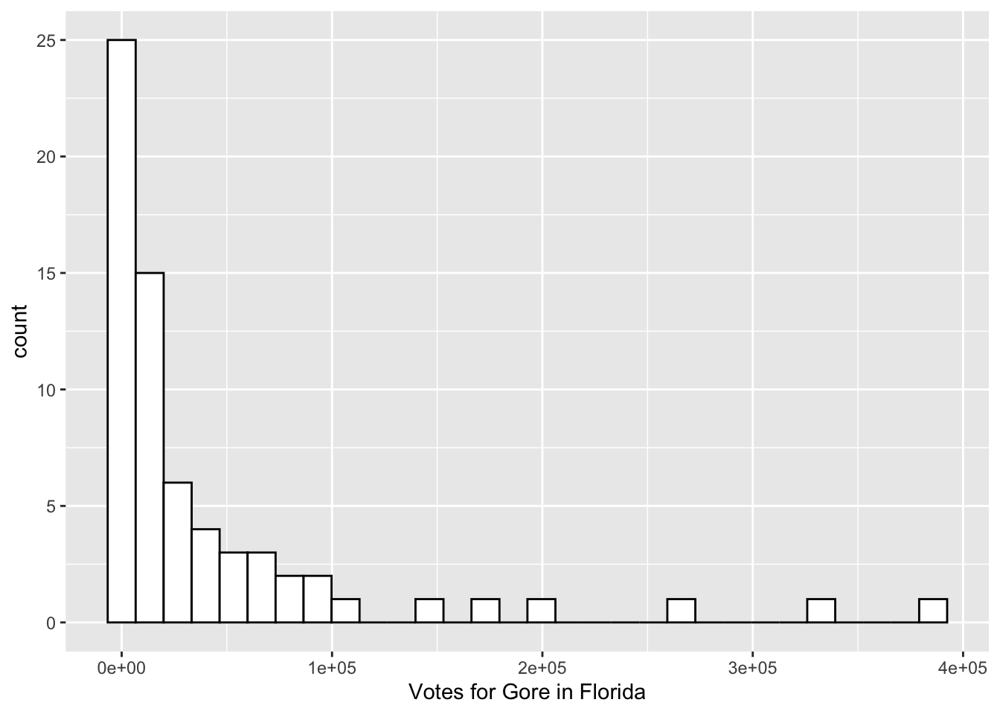

* What do the 1e+05, 2e+05, etc. labels on the x-axis mean?

<br>

* `R` gives us a message to "Pick a better value with `binwidth`" instead of the default `bins = 30`. Add `, bins = 15` (but without the backticks) inside the parentheses of `geom_histogram()` to change the number of bins in the histogram.

<br>

* Change the colour of the inside of the bins to "darkred". Do you think that the colour of the inside of the bins maps to `colour` or `fill`? Try both!

<br>

* There are a couple of observations with very high vote values. What could explain these large outliers?

<br>

Another graph useful in visualizing a single quantitative variable is a frequency plot. The code to make a frequency plot is given below:


```r
ggplot(data = pres_df, mapping = aes(x = Gore)) +
  geom_freqpoly(colour = "black") +
  xlab("Votes for Gore in Florida") 
```

```
## `stat_bin()` using `bins = 30`. Pick better value with `binwidth`.
```

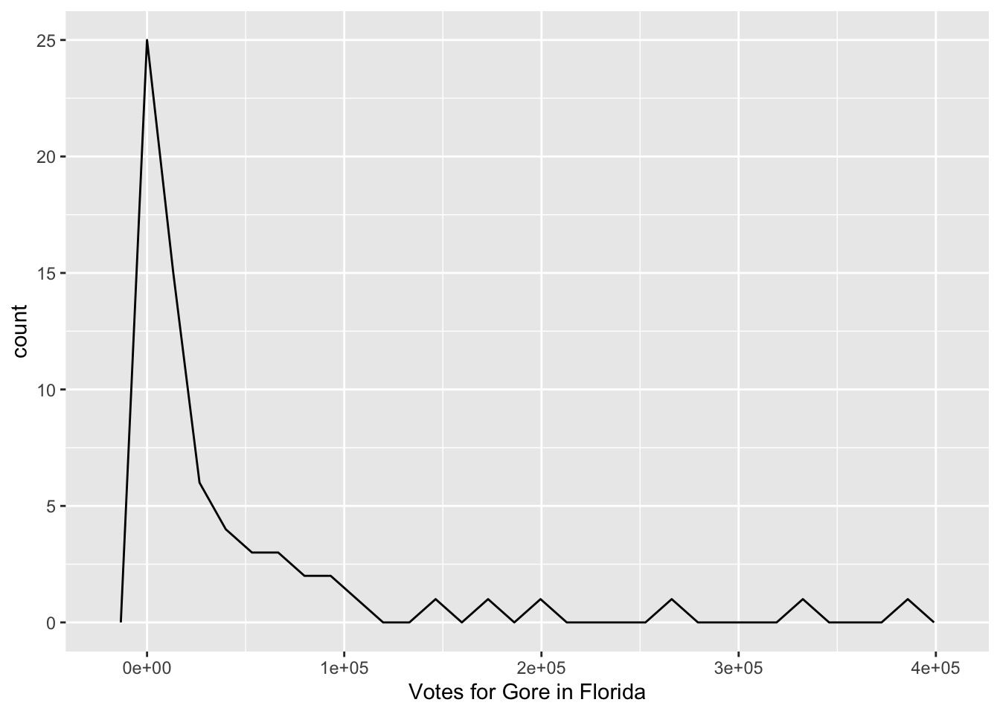

The frequency plot is just like a histogram but the counts are connected by a line instead of represented with bins. You can see how they relate by including __both__ a geom_freqpoly() and a geom_histogram() in your plot, though it doesn't make for the prettiest graph:


```r
ggplot(data = pres_df, mapping = aes(x = Gore)) +
  geom_freqpoly(colour = "black") +
  xlab("Votes for Gore in Florida") +
  geom_histogram() 
```

```
## `stat_bin()` using `bins = 30`. Pick better value with `binwidth`.
## `stat_bin()` using `bins = 30`. Pick better value with `binwidth`.
```

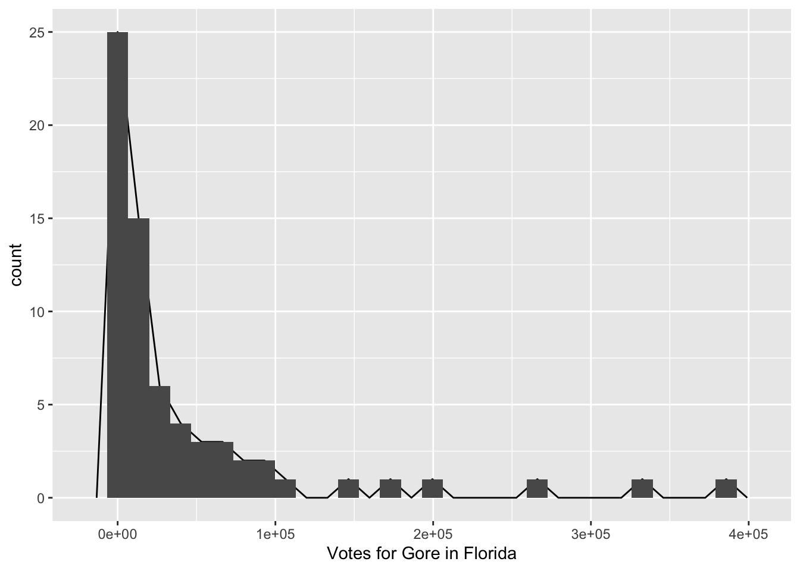

* Change the frequency plot to plot the number of votes for Bush instead of the number for Gore. Are there any obvious outliers in the Bush frequency plot?

<br>

--------------------------

##### `R` Code Style

We want our code to be as readable as possible. This not only benefits other people who may read your code (like me), but it also benefits you, particularly if you read your own code in the future. I try to follow the Style Guide in the Advanced `R` book: <http://adv-r.had.co.nz/Style.html>. Feel free to skim through that, but you don't need to worry about it too much: you should be able to pick up on some important elements just from going through these tutorials. 

As a quick example of why code style can be important, consider the following two code chunks, both of which produce the same graph.


```r
ggplot(data=pres_df,mapping=aes(x=Gore))+geom_histogram(colour="black",fill="white")+
  xlab("Votes for Gore in Florida")
```


```r
ggplot(data = pres_df, mapping = aes(x = Gore)) +
  geom_histogram(colour = "black", fill = "white") +
  xlab("Votes for Gore in Florida")
```

Which code chunk would you want to read two years from now? Which code chunk would you want your classmate/friend/coworker to read? (assuming you like your classmate/friend/coworker....)

<br>

__Your Turn: Complete the Exercises Associated with Part A in the Week1_ggplot_exercises.html file.__

-----------------------------------------------

## Scatterplots, Faceting, and Other Options (B)

Thus far, we've figured out that there a couple of counties with very large numbers of votes for Gore and very large number of votes for Bush. We don't know the reason for this (if some counties are very democratic, very republican, or if some counties are just more populous). Do the counties that have a large number of votes for Bush also tend to have a large number of votes for Gore? And what about the other candidates: do they have any interesting patterns?

Let's start by making a scatterplot of the number of votes for Gore and the number of votes for Bush: what additional `aes()` argument will we need?


```r
ggplot(data = pres_df, mapping = aes(x = Gore, y = Bush)) +
  geom_point()
```

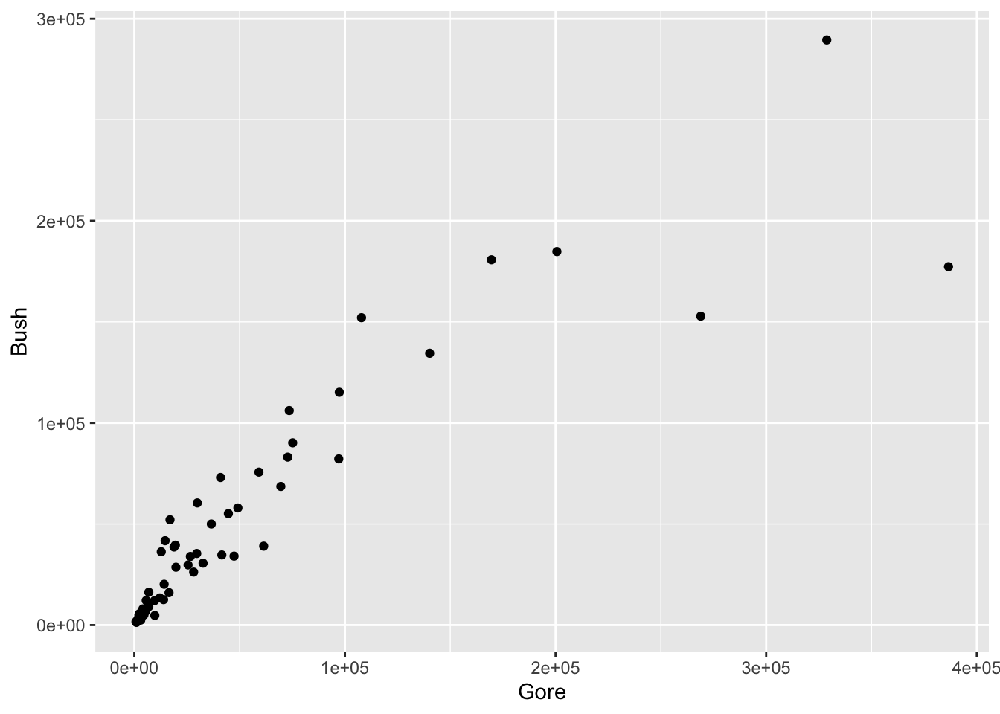

* what patterns do you see in the scatterplot?

<br>

* add an x-axis label and a y-axis label to the plot with `xlab()` and `ylab()` (see the histogram above for an example using `xlab()`).

<br>

* change the x variable from `Gore` to `Buchanan`. What do you notice?

<br>

* You should have noticed something very strange in the scatterplot of votes with `Bush` on the y-axis and third-party candidate `Buchanan` on the x-axis. Come up with one explanation for why the outlying point has so many votes for `Buchanan`.

<br>

It would be nice to figure out which Florida county has that outlying point. Recall that we can use `View()` to pull up the data set. Once you have the new window open, click on the column heading `Buchanan` to sort the votes for Buchanan from high to low to figure out which county is the outlier.


```r
View(pres_df)
```

* Use your sleuthing skills to find an explanation: try using Google to search for "2000 united states presidential election [name of outlier county]". Write a sentence about what you find. Hint: if nothing useful pops up, try adding the term "butterfly ballot" to your search.

<br>

We have used the 2000 Presidential data set to find out something really interesting! In particular, we have used _exploratory data analysis_ to examine a data set, without having a specific question of interest that we want to answer. This type of exploring is often really useful, but does have some drawbacks, which we will discuss later in the semester.

------------------------

##### Fitness Data 

For the remainder of this document, we will work with some fitness data collected from my Apple Watch since November 2018. The `higham_fitness_clean.csv` contains information on the following variables:

* `Start`, the month, day, and year that the fitness data was recorded on
* `month`, the month
* `weekday`, the day of the week
* `dayofyear`, the day of the year (so that 304 corresponds to the 304th day of the year)
* `distance`, distance walked in miles
* `steps`, the number of steps taken
* `flights`, the number of flights of stairs climbed
* `active_cals`, the number of calories burned from activity
* `stepgoal`, whether or not I reached 10,000 steps for the day
* `weekend_ind`, a variable for whether or not the day of the week was a weekend day (Saturday or Sunday) or a weekday (Monday - Friday).

(If you're interested in getting a .csv file of your own fitness data and you have an Apple Watch, the QS Access App makes it really easy!)


```r
library(tidyverse)
fitness <- read_csv("higham_fitness_clean.csv") %>% mutate(weekend_ind = case_when(weekday == "Sat" | weekday == "Sun" ~ "weekend",
  TRUE ~ "weekday"))
```

```
## Parsed with column specification:
## cols(
##   Start = col_date(format = ""),
##   month = col_character(),
##   weekday = col_character(),
##   dayofyear = col_double(),
##   distance = col_double(),
##   steps = col_double(),
##   flights = col_double(),
##   active_cals = col_double(),
##   stepgoal = col_character()
## )
```

First, let's make a basic scatterplot to illustrate why it's so important to plot your data. I'll use the variable `distance` as the x-variable and `active_cals` as the y-variable.


```r
ggplot(data = fitness, aes(x = distance, y = active_cals)) +
  geom_point()
```


One aspect of the plot that you may notice is that there are observations where I burned 0 or very few active calories, yet walked/jogged/ran/moved some distance. Is it possible to not burn any calories and move ~ 4 miles? Probably not, so let's drop these observations from the data set and make a note of why we dropped those observations. Unfortunately, we don't have the tools to do this yet, so just run the following chunk of code without worrying too much about the syntax.


```r
## drop observations that have active calories < 50. 
## assuming that these are data errors, days where I did not wear my watch, etc.
fitness <- fitness %>%
  filter(active_cals > 50)
```

Let's make the plot again to see if the outliers are actually gone. This time, we will put the `aes()` in the `geom_point()` function:


```r
ggplot(data = fitness) +
  geom_point(aes(x = distance, y = active_cals))
```

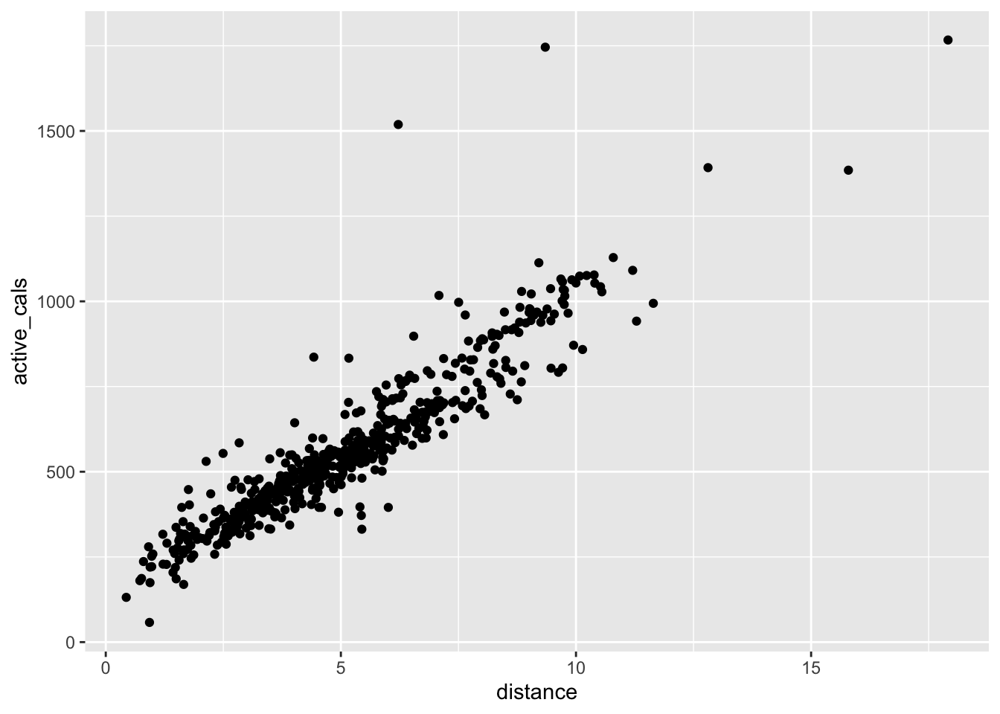

Putting the `aes()` in `ggplot()` and putting the `aes()` in `geom_point()` results in the same graph in this case. When you put the `aes()` in `ggplot()`,  `R` perpetuates these `aes()` in all `geom_    `s in your plotting command. However, if you put your `aes()` in `geom_point()`, then any future `geom    `s that you use will need you to re-specify different `aes()`. We'll see an example of this in the exercises.

---------------------------------

##### Other `aes()` Options

In addition to `x` and `y`, we can also use `aes()` to map variables to things like `colour`, `size`, and `shape`. For example, we might make a scatterplot with `Start` on the x-axis (for the date) and `active_cals` on the y-axis, colouring by whether or not the day of the week was a weekend.


```r
ggplot(data = fitness) +
  geom_point(aes(x = Start, y = active_cals, colour = weekend_ind))
```

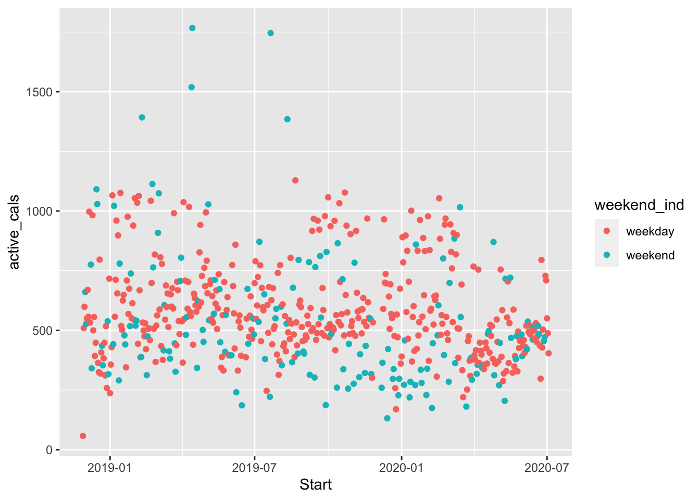

* Is there anything you notice about the plot?

<br>

Instead of using colour, you can also specify the point shape. This could be useful, for example, if you are printing something in black and white.


```r
ggplot(data = fitness) +
  geom_point(aes(x = Start, y = active_cals, shape = weekend_ind))
```

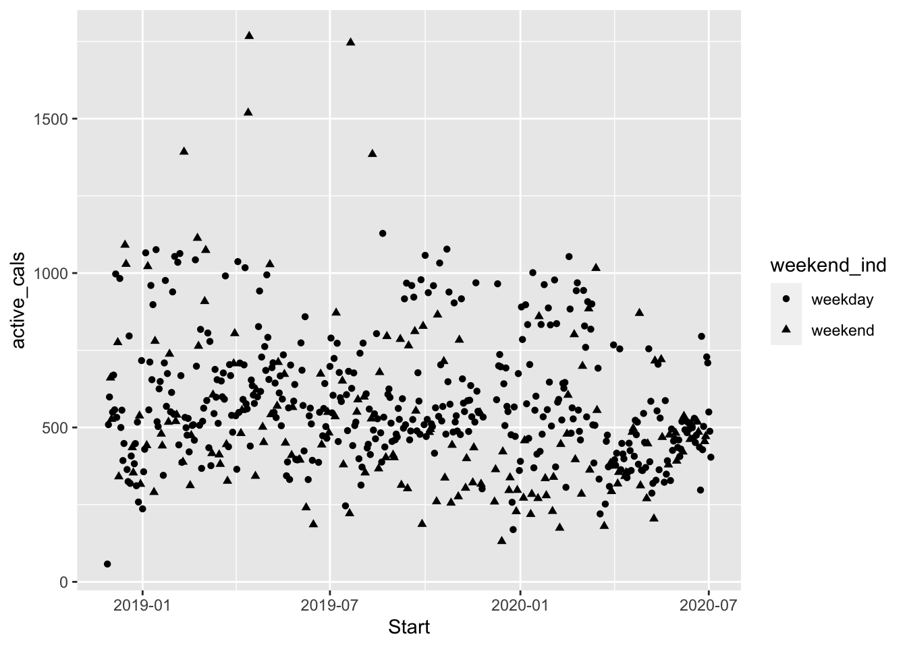

That's pretty awful. `ggplot()` actually won't even plot more than 6 shapes because humans can't really process that many shapes on a plot. 

Finally, another common `aes()` is `size`. For example, we could make the size of the points in the scatterplot change depending on how many `flights` of stairs I climbed.


```r
ggplot(data = fitness) +
  geom_point(aes(x = Start, y = active_cals, size = flights))
```

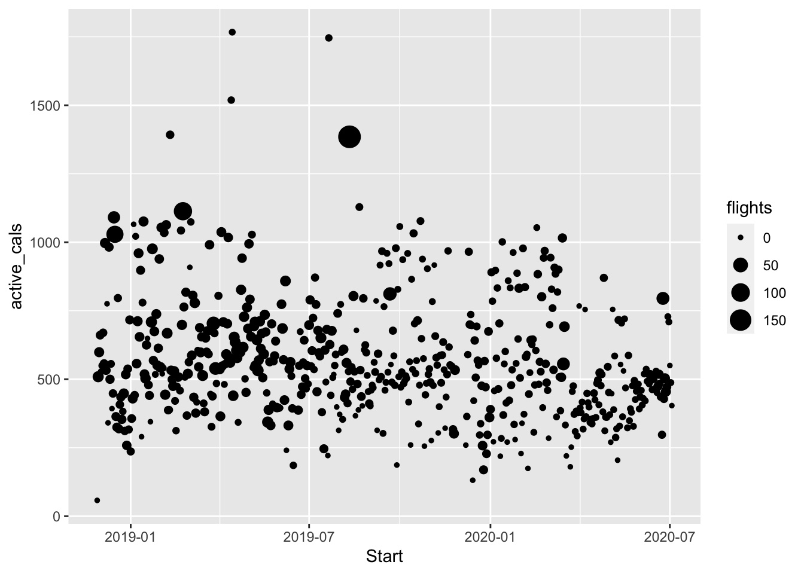

-------------------------------

##### Inside vs Outside `aes()`

We've changed the colour of the points to correspond to `weekend_ind`, but what if we just wanted to change the colour of points to all be the same colour, `"purple"`. Try running the following code chunk:


```r
ggplot(data = fitness) +
  geom_point(aes(x = Start, y = active_cals, colour = "purple"))
```

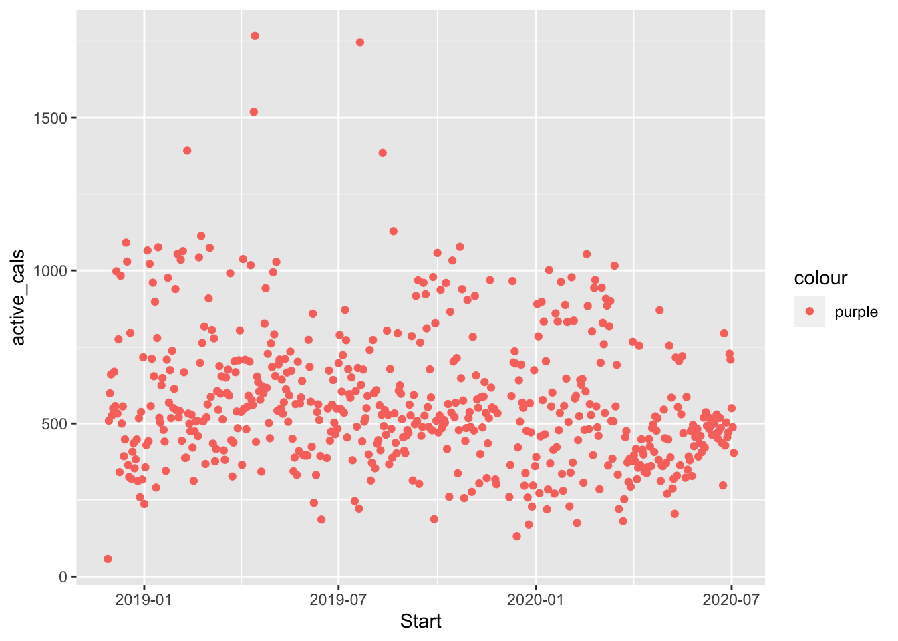

* What does the graph look like? Did it do what you expected?

<br>

* In general, when we want to map something in our data set (`fitness`) to something in our plot (`x`, `y`, `colour`, `size`, etc.), we put that __inside__ the `aes()`. 

* When we assign fixed characteristics that don't come from the data, we put them __outside__ the `aes()`. 

Fix the above code chunk to make all of the points "purple" by moving `colour = "purple"` outside the parentheses in `aes()` (but still inside `geom_point()`).

<br>

You can also change the overall point size and shape. The standard size is `1` so the following code chunk makes the points bigger:


```r
ggplot(data = fitness) +
  geom_point(aes(x = Start, y = active_cals), size = 1.5)
```

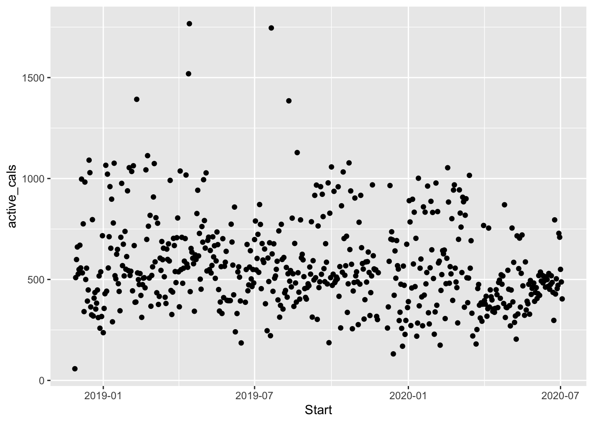

----------------------------------

##### Using More Than One `geom()`

We might also be interested in fitting a smooth curve to our scatterplot. When we want to put more than one "shape" on our plot, we can use multiple `geoms`. Since I want the `aes()` to apply to __both__ `geom_point()` and `geom_smooth()`, I am going to move the `aes()` command to the overall `ggplot()` line of code:


```r
ggplot(data = fitness, aes(x = Start, y = active_cals, colour = weekend_ind)) +
  geom_point() +
  geom_smooth()
```

```
## `geom_smooth()` using method = 'loess' and formula 'y ~ x'
```

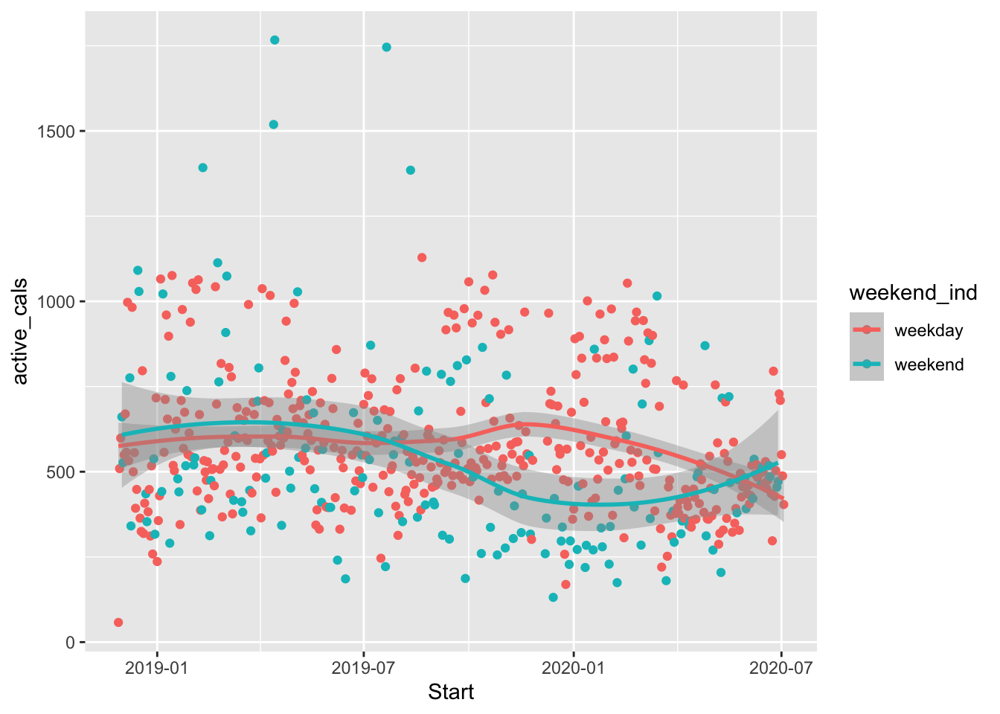

Within `geom_smooth()`, you can set `se = FALSE` to get rid of the grey standard errors around each of the lines, and you can set`method = "lm"` to fit straight linear regression lines instead of smooth curves:


```r
ggplot(data = fitness, aes(x = Start, y = active_cals, colour = weekend_ind)) +
  geom_point() +
  geom_smooth(se = FALSE, method = "lm")
```

```
## `geom_smooth()` using formula 'y ~ x'
```

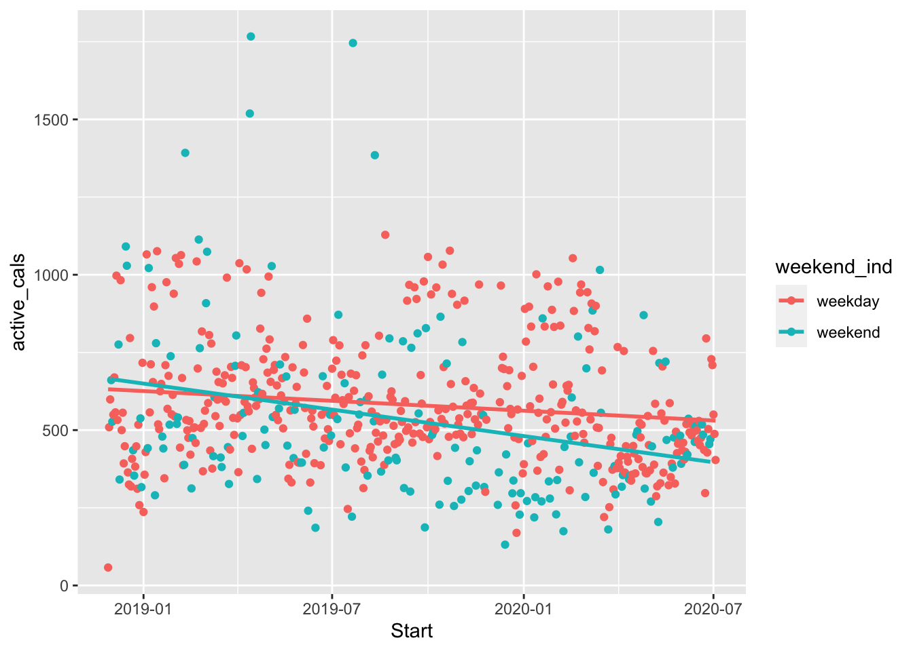

* What's happening to Professor Higham? Why is he getting lazier? No need to answer that. But, do answer this question: for which group of days (weekends or weekdays) is the average active calories changing more quickly with time?

<br>

-----------------

##### Faceting

The coloured plot above is fine when there are just a couple of colours. But, what if there are more than two categories to colour by. For example, let's make the same plot as the previous chunk and change the `method = "lm"` to be a smooth line instead. But, we wll now colour by day of the week:


```r
ggplot(data = fitness, aes(x = Start, y = active_cals, colour = weekday)) +
  geom_point() +
  geom_smooth(se = FALSE)
```

```
## `geom_smooth()` using method = 'loess' and formula 'y ~ x'
```

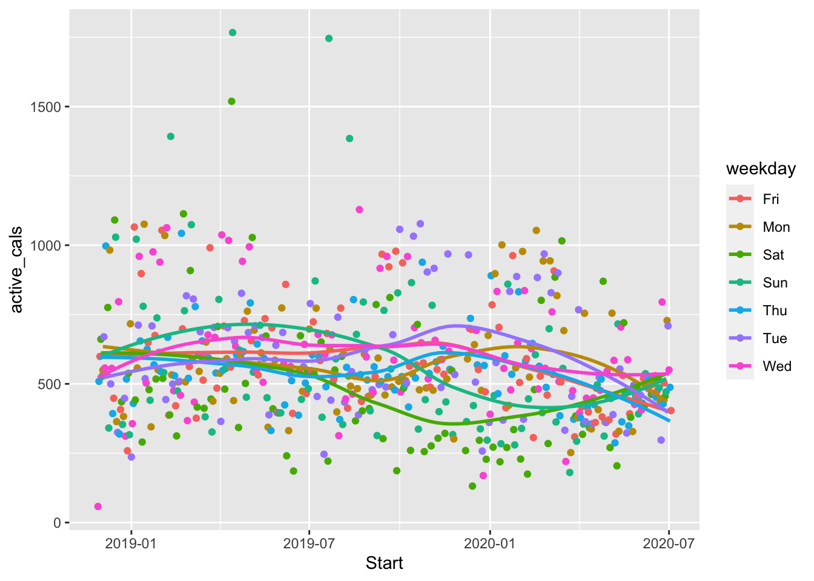

When there are many different categories for a categorical variable (there are 7 categories for `weekday`), it can sometimes be useful to `facet` the plot by that variable instead of trying to use different `colour`s or `shape`s.


```r
ggplot(data = fitness, aes(x = Start, y = active_cals)) +
  geom_point() +
  geom_smooth(se = FALSE) +
  facet_wrap( ~ weekday)
```

```
## `geom_smooth()` using method = 'loess' and formula 'y ~ x'
```

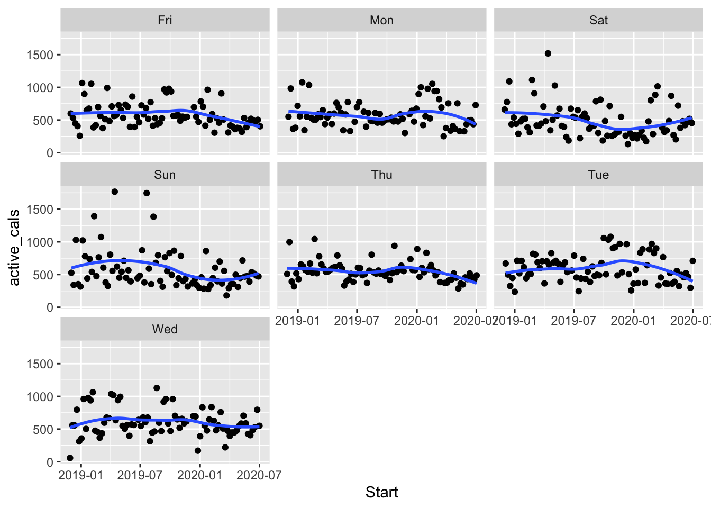

We have eliminated the `colour = ` argument and added `facet_wrap( ~ name_of_facet_variable)`. Doing so creates a different scatterplot and smooth line for each level of `name_of_facet_variable`. 

It would be nice if we could change the order of how the days appear, but we will learn how to change that later in the semester.

* Do you spot any unusual patterns or clumps of points in the plot? Can you come up with a possible reason for the unusual pattern or clump?

<br>

__Your Turn: Complete the Exercises Associated with Part B in the Week1_ggplot_exercises.html file.__

------------------------------

## Other Plots in `ggplot2` (C)

There are a few other common geoms that will be useful throughout the semester.

-------------------------------

##### Line Plots with `geom_line()`

Line plots are often useful when you have a quantitative variable that you'd like to explore over time. The y-axis is the quantitative variable while the x-axis is typically time. For example, suppose we want to explore how my step count has changed through time over the past couple of years. Compare the standard scatterplot with the following line plot: which do you prefer?


```r
ggplot(data = fitness, mapping = aes(x = Start, y = steps)) +
  geom_point() + geom_smooth() + xlab("Date")
```

```
## `geom_smooth()` using method = 'loess' and formula 'y ~ x'
```

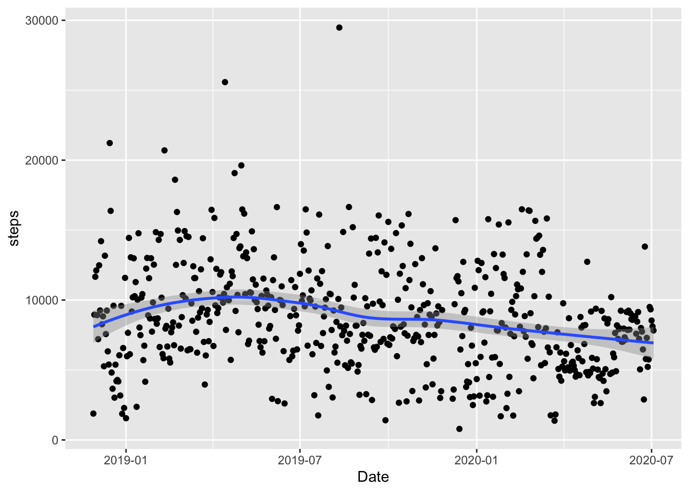

```r
ggplot(data = fitness, mapping = aes(x = Start, y = steps)) +
  geom_line() + geom_smooth() + xlab("Date")
```

```
## `geom_smooth()` using method = 'loess' and formula 'y ~ x'
```


Remember how everyone else was posting about getting fit during the pandemic lockdown? The plot suggests I was certainly __not__ doing that and went in the other direction. 

* In the console window, type `?geom_smooth` and scroll down to "Arguments." Find `span`, read about it, and then, within `geom_smooth()`, add a `span` argument to make the smooth line wigglier. 

<br>

--------------------------------------

##### Boxplots with `geom_boxplot()`

Another common plot used in Intro Stat courses is a boxplot. Side-by-side boxplots are particularly useful if you want to compare a quantitative response variable across two or more levels of a categorical variable. Let's see if there is a particular day of the week where I tend to burn more or less calories. The only part of the code that's new is the `geom_boxplot()` `geom`.


```r
ggplot(data = fitness, aes(x = weekday, y = active_cals)) +
  geom_boxplot()
```

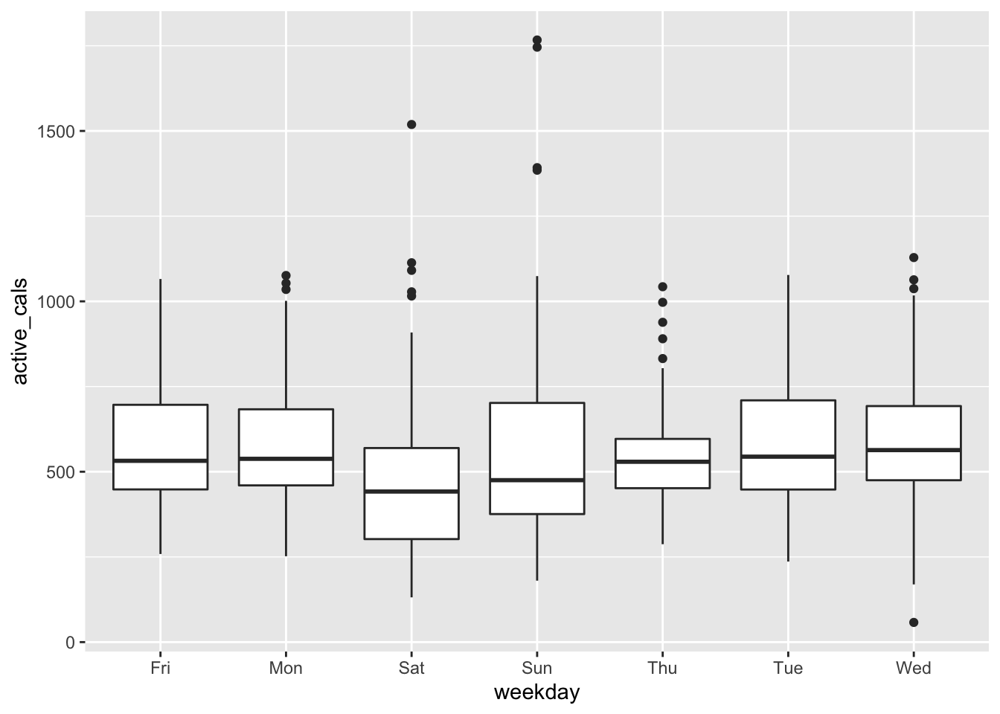

* Write down an observation that you notice in the plot about my fitness patterns across different days of the week.

<br>

* change the colour of the inside of the boxplots to be `"blue"`. Do you think you'll use `colour = "blue"` or `fill = "blue"`? You can try both!

<br>

An alternative to side-by-side boxplots are violin plots:


```r
ggplot(data = fitness, aes(x = weekday, y = active_cals)) +
  geom_violin()
```

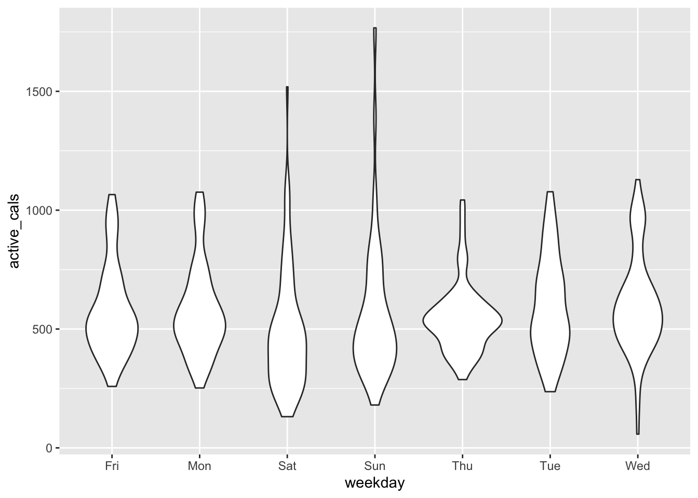

* read about Violin plots by typing `?geom_violin` into your console (bottom-left window). How are they different than boxplots?

<br>

---------------------------------

##### Bar Plots with `geom_bar()`

Recall from STAT 113 that bar plots are useful if you want to examine the distribution of one categorical variable. Side-by-side bar plots or stacked bar plots are plots that are useful for looking at the relationship between two categorical variables. 

First, let's make a simple bar plot of the `weekday` variable:


```r
ggplot(data = fitness, aes(x = weekday)) +
  geom_bar()
```

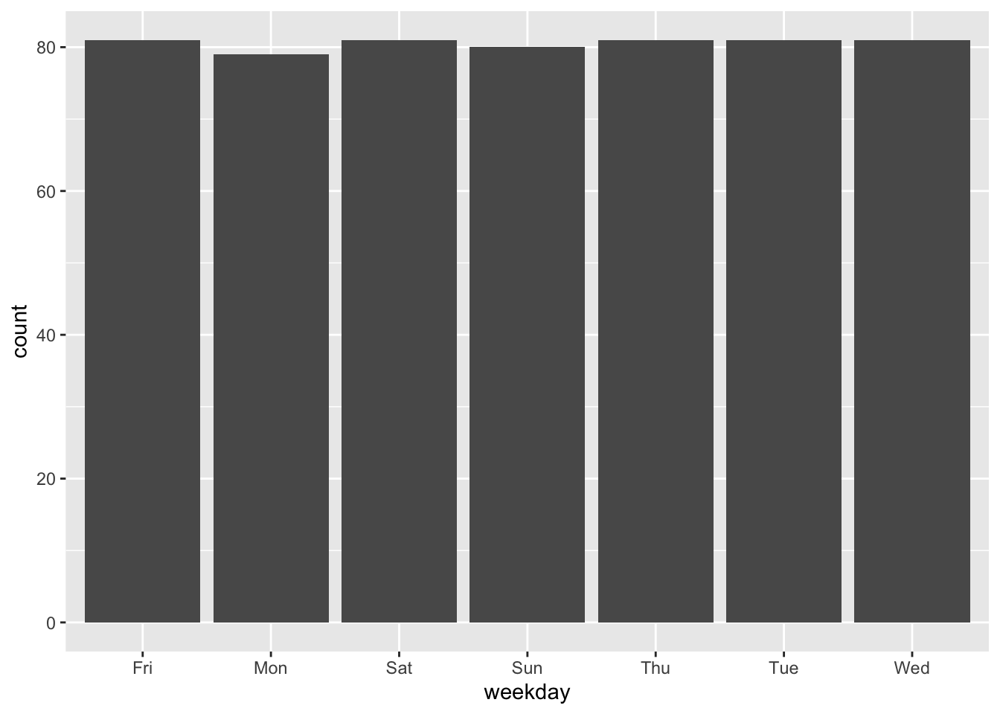

* The bars all look like they are roughly the same height. Why does this make sense?

<br>

* Though the bars are all roughly the same height, they are not exactly the same height. Make a guess as to why each bar isn't exactly the same height. Hint: Recall that the data come from a wearable Apple Watch.

<br>

Let's make the same graph for the `month` variable


```r
ggplot(data = fitness, aes(x = month)) +
  geom_bar()
```

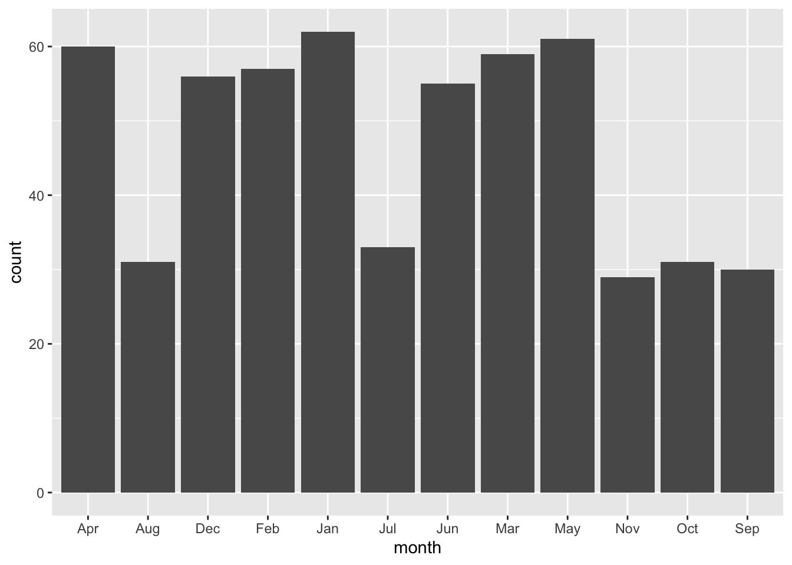

* We see that there are some months that have many more observations than others. Why?

<br>

The only combination of two variables that we have yet to explore are two variables that are both categorical. Let's look at the relationship between `stepgoal` and `month` first using a stacked bar plot. In particular, we might be interested in whether there seems to be evidence that I complete the 10000 step-goal more often in certain months.

To make the graph, we specify `position = "fill"` so that the bars are "filled" by `stepgoal`.


```r
ggplot(data = fitness, mapping = aes(x = month, fill = stepgoal)) +
  geom_bar(position = "fill") +
  ylab("Proportion")
```

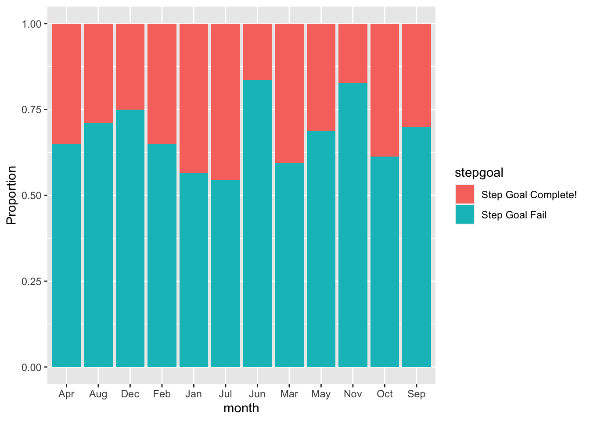

* In which month did I complete the step goal the highest proportion of times? The lowest?

<br>

* Recall that some months have fewer observations than other months from the simple bar plot. Also recall that it looked like my exercise habits were trending downward recently. How do these observations affect the conclusions that you can draw from this stacked bar plot?

<br>

Again, we run into an issue of ordering: `R` is ordering the months alphabetically. The graph would be easier to read if we could figure out how to order the months chronologically. We won't discuss this now, but here is some code to order the months just so we can read the plot a bit more easily:


```r
fitness <- fitness %>% mutate(month = factor(month, levels = month.abb))
ggplot(data = fitness, mapping = aes(x = month, fill = stepgoal)) +
  geom_bar(position = "fill") +
  ylab("Proportion")
```

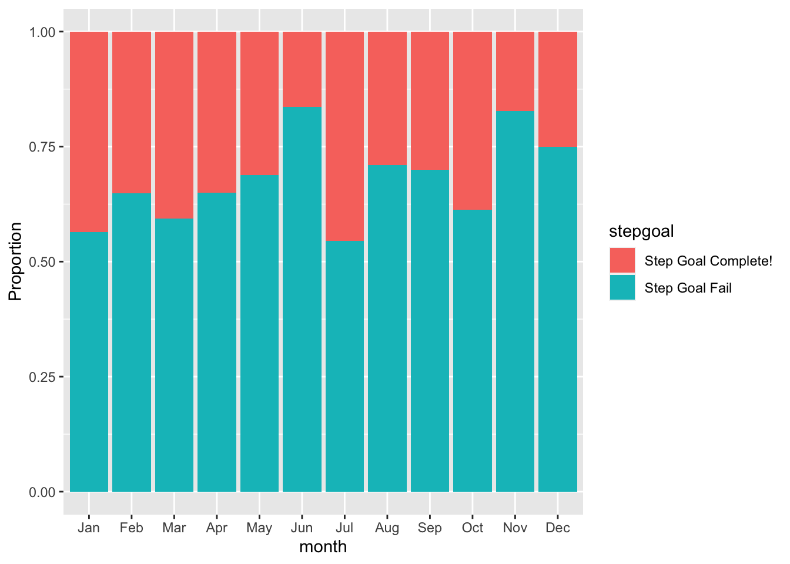

I've got that "New Year, New Me!" January workout attitude that may cause the higher proportion of completions at the beginning of the year.

We can also make a side-by-side bar chart. The only argument that changes is `position = "fill"` becomes `position = "dodge"`:


```r
ggplot(data = fitness, mapping = aes(x = month, fill = stepgoal)) +
  geom_bar(position = "dodge")
```

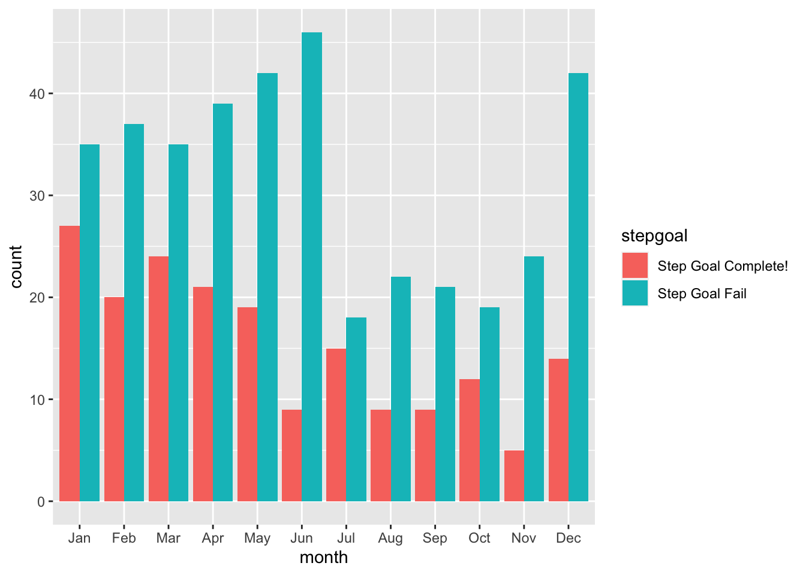

* Which graph do you prefer: the stacked bar chart or the side-by-side bar chart?

<br>

* How would you know that it's `position = "dodge"` to make the side-by-side bar plot if I hadn't given you the code? One option is to use the `R` help by typing in `?geom_bar` into your console window. But it can be difficult to read sometimes. Try using google, searching something like "make side by side bar chart in r ggplot." It will get easier to search as we move along in this course: oftentimes, StackOverflow has answers that are explained well. Were you able to find an answer that uses `position = "dodge"`?

<br>

__Your Turn: Complete the Exercises Associated with Part C in the Week1_ggplot_exercises.html file.__
