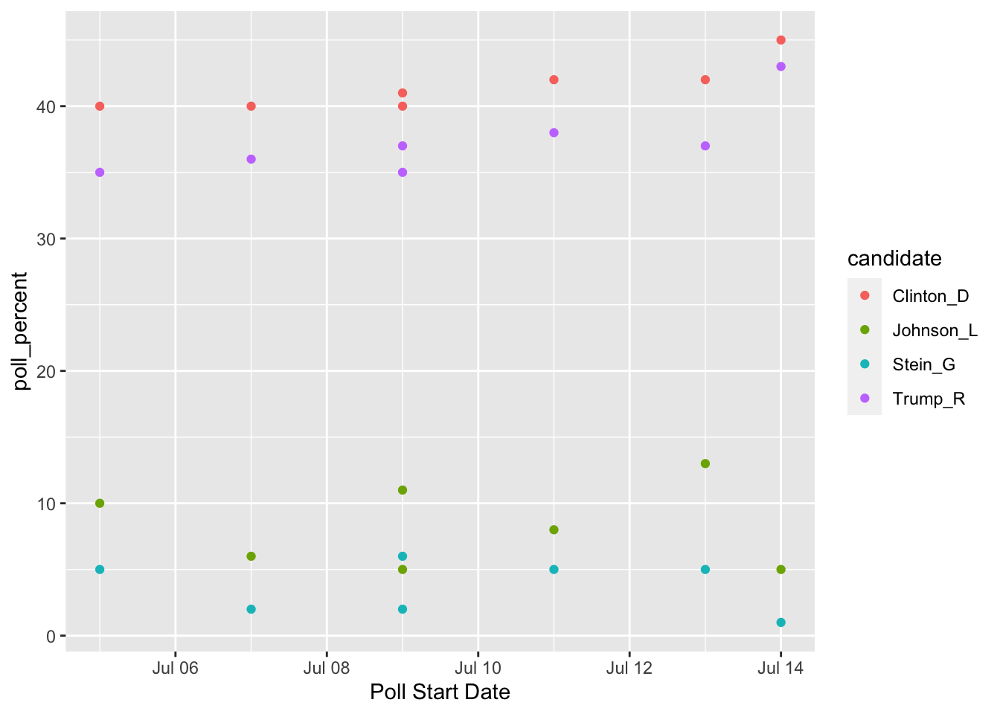
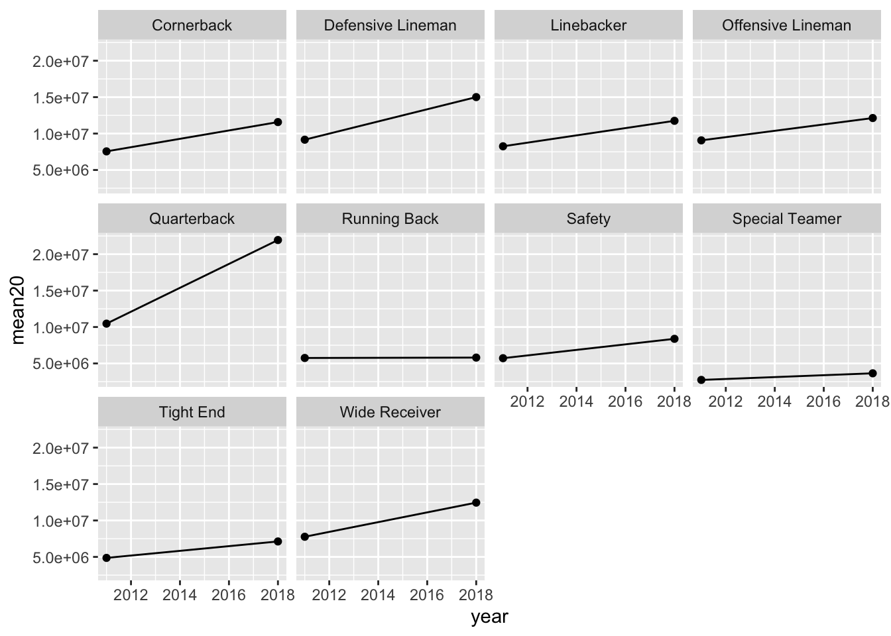

# Tidying with `tidyr`

__Goals:__

* describe what it means for a data set to be __tidy__.

* use `separate()` and `unite()` to transform a data set into tidy form.

* use `pivot_longer()` and `pivot_wider()` to transform a data set into tidy form.

* combine `tidyr` functions with `dplyr` and `ggplot2` functions to form a more complete workflow.

__The Data__: We will first use a polling data set that contains variables collected from a few different polls in July 2016 for the U.S. presidential election. The data set was scraped from RealClear politics <https://www.realclearpolitics.com/epolls/latest_polls/president/> by Dr. Ramler. The variables are:

* `Poll`, the name of the poll
* `Date`, the date range that the poll was conducted
* `Sample`, contains the sample size of the poll and whether the poll was of Likely Voters or Registered Voters
* `MoE`, the margin of error of the poll (recall this term from IntroStat)
* `Clinton (D)`, the percentage of people in the poll voting for Clinton
* `Trump (R)`, the percentage of people in the poll voting for Trump
* `Johnson (L)`, the percentage of people in the poll voting for Johnson
* `Steing (G)`, the percentage of people in the poll voting for Stein

## What is Tidy Data?

`R` usually (but not always) works best when your data is in tidy form. A tidy data set has a few characteristics. Note that you should already be quite familiar with tidy data because, up to this point, all of the data sets we have used in this class (and probably most of the data sets that you see in STAT 113 an all of the data sets that you may have seen in STAT 213) are tidy. This definition of tidy data is taken from `R for Data Science`:

1. every variable in the data set is stored in its own column
2. every case in the data set is stored in its own row
3. each value of a variable is stored in one cell
4. values in the data set should __not__ contain units
5. there should not be any table headers or footnotes

We will begin by focusing on the first characteristic: every variable in a the data set should be stored in its own column (and correspondingly, number 3: each value of a variable should be stored in one cell).

## `separate()` and `unite()` Columns

In a fresh .Rmd file (File -> New File -> R Markdown) that is in your Notes project, copy and paste the following code into an `R` chunk:


```r
library(tidyverse)
polls <- read_csv("data/rcp-polls.csv", na = "--")
polls
```

```
## # A tibble: 7 x 8
##   Poll    Date  Sample   MoE `Clinton (D)` `Trump (R)` `Johnson (L)` `Stein (G)`
##   <chr>   <chr> <chr>  <dbl>         <dbl>       <dbl>         <dbl>       <dbl>
## 1 Monmou… 7/14… 688 LV   3.7            45          43             5           1
## 2 CNN/ORC 7/13… 872 RV   3.5            42          37            13           5
## 3 ABC Ne… 7/11… 816 RV   4              42          38             8           5
## 4 NBC Ne… 7/9 … 1000 …   3.1            41          35            11           6
## 5 Econom… 7/9 … 932 RV   4.5            40          37             5           2
## 6 Associ… 7/7 … 837 RV  NA              40          36             6           2
## 7 McClat… 7/5 … 1053 …   3              40          35            10           5
```

Suppose that you wanted to know what the average sample size of the polls was. Using `dplyr` functions,


```r
polls %>% summarise(meansample = mean(Sample))
```

What warning do you get? Why?

You would get a similar warning (or sometimes an error) any time that you want to try to use `Sample` size in plotting or summaries. The issue is that the `Sample` column actually contains two variables so the data set is not tidy. 

### `separate()` a Column

Let's `separate()` the two variables into `Sample_size` and `Sample_type`:


```r
polls %>%
  separate(col = Sample, into = c("Sample_size", "Sample_type"), 
           sep = " ")
```

```
## # A tibble: 7 x 9
##   Poll           Date    Sample_size Sample_type   MoE `Clinton (D)` `Trump (R)`
##   <chr>          <chr>   <chr>       <chr>       <dbl>         <dbl>       <dbl>
## 1 Monmouth       7/14 -… 688         LV            3.7            45          43
## 2 CNN/ORC        7/13 -… 872         RV            3.5            42          37
## 3 ABC News/Wash… 7/11 -… 816         RV            4              42          38
## 4 NBC News/Wall… 7/9 - … 1000        RV            3.1            41          35
## 5 Economist/You… 7/9 - … 932         RV            4.5            40          37
## 6 Associated Pr… 7/7 - … 837         RV           NA              40          36
## 7 McClatchy/Mar… 7/5 - … 1053        RV            3              40          35
## # … with 2 more variables: Johnson (L) <dbl>, Stein (G) <dbl>
```

The arguments to `separate()` are fairly easy to learn:

* `col` is the name of the column in the data set you want to separate.

* `into` is the name of the new columns. These could be anything you want, and are entered in as a vector (with `c()` to separate the names)

* `sep` is the character that you want to separate the column by. In this case, the sample size and sample type were separated by whitespace, so our `sep = " "`, white space. 

The `sep` argument is the newest piece of information here. Note that even using `sep = ""` will produce an error (there is not a space now, so `R` doesn't know what to separate by).


```r
polls %>%
  separate(col = Sample, into = c("Sample_size", "Sample_type"), 
           sep = "")
```

Similarly, we would like the `Date` column to be separated into a poll start date and a poll end date:


```r
polls_sep <- polls %>%
  separate(col = Date, into = c("Start", "End"),
           sep = " - ")
```

Why should you use `" - "` as the separator instead of `"-"`? Try using `"-"` if you aren't sure: you shouldn't get an error but something should look off.

What happened to `Sample`? Why is it back to its un-separated form?

### `unite()` Columns

`unite()` is the "opposite" of `separate()`: use it when one variable is stored across multiple columns, but each row still represents a single case. The need to use `unite()` is less common than `separate()`. In our current data set, there is no need to use it at all. But, for the sake of seeing an example, let's separate the `Start` date into `month` and `day` and then use `unite()` to re-unite those columns:


```r
polls_sillytest <- polls_sep %>%
  separate(col = Start, into = c("Start_month", "Start_day"), 
           sep = "/")
polls_sillytest
```

```
## # A tibble: 7 x 10
##   Poll        Start_month Start_day End   Sample   MoE `Clinton (D)` `Trump (R)`
##   <chr>       <chr>       <chr>     <chr> <chr>  <dbl>         <dbl>       <dbl>
## 1 Monmouth    7           14        7/16  688 LV   3.7            45          43
## 2 CNN/ORC     7           13        7/16  872 RV   3.5            42          37
## 3 ABC News/W… 7           11        7/14  816 RV   4              42          38
## 4 NBC News/W… 7           9         7/13  1000 …   3.1            41          35
## 5 Economist/… 7           9         7/11  932 RV   4.5            40          37
## 6 Associated… 7           7         7/11  837 RV  NA              40          36
## 7 McClatchy/… 7           5         7/9   1053 …   3              40          35
## # … with 2 more variables: Johnson (L) <dbl>, Stein (G) <dbl>
```

This situtation could occur in practice: the date variable is in multiple columns: one for month and one for day (and if there are multiple years, there could be a third for year). We would use `unite()` to combine these two columns into a single `Date`, called `New_start_date`:


```r
polls_sillytest %>%
  unite("New_start_date", c(Start_month, Start_day),
        sep = "/")
```

```
## # A tibble: 7 x 9
##   Poll               New_start_date End   Sample   MoE `Clinton (D)` `Trump (R)`
##   <chr>              <chr>          <chr> <chr>  <dbl>         <dbl>       <dbl>
## 1 Monmouth           7/14           7/16  688 LV   3.7            45          43
## 2 CNN/ORC            7/13           7/16  872 RV   3.5            42          37
## 3 ABC News/Wash Post 7/11           7/14  816 RV   4              42          38
## 4 NBC News/Wall St.… 7/9            7/13  1000 …   3.1            41          35
## 5 Economist/YouGov   7/9            7/11  932 RV   4.5            40          37
## 6 Associated Press-… 7/7            7/11  837 RV  NA              40          36
## 7 McClatchy/Marist   7/5            7/9   1053 …   3              40          35
## # … with 2 more variables: Johnson (L) <dbl>, Stein (G) <dbl>
```

Note how `unite()` just switches around the first two arguments of `separate()`. Argument 1 is now the name of the new column and Argument 2 is the names of columns in the data set that you want to combine.

We have also used the `c()` function in `separate()` and `unite()`. While `c()` is a very general `R` function and isn't specific to tidy data, this is the first time that we're seeing it in this course. `c()` officially stands for concatenate, but, in simpler terms, `c()` combines two or more "things", separated by a comma.


```r
c(1, 4, 2)
```

```
## [1] 1 4 2
```

```r
c("A", "A", "D")
```

```
## [1] "A" "A" "D"
```

This is useful if a function argument expects two or more "things": for example, in `separate()`, the `into` argument requires two column names for this example. Those column names must be specified by combining the names together with `c()`.

### Column Names and `rename()`

You might have noticed that the columns with percentage of votes for Clinton, Trump, etc. are surrounded by backticks \` \` when you print `polls` or `polls_sep`:


```r
polls_sep
```

```
## # A tibble: 7 x 9
##   Poll          Start End   Sample   MoE `Clinton (D)` `Trump (R)` `Johnson (L)`
##   <chr>         <chr> <chr> <chr>  <dbl>         <dbl>       <dbl>         <dbl>
## 1 Monmouth      7/14  7/16  688 LV   3.7            45          43             5
## 2 CNN/ORC       7/13  7/16  872 RV   3.5            42          37            13
## 3 ABC News/Was… 7/11  7/14  816 RV   4              42          38             8
## 4 NBC News/Wal… 7/9   7/13  1000 …   3.1            41          35            11
## 5 Economist/Yo… 7/9   7/11  932 RV   4.5            40          37             5
## 6 Associated P… 7/7   7/11  837 RV  NA              40          36             6
## 7 McClatchy/Ma… 7/5   7/9   1053 …   3              40          35            10
## # … with 1 more variable: Stein (G) <dbl>
```

This happens because the column names have a space in them (this also would occur if the columns started with a number or had odd special characters in them). Then, any time you want to reference a variable, you need the include the backticks:


```r
polls_sep %>%
  summarise(meanclinton = mean(Clinton (D))) ## throws an error
polls_sep %>%
  summarise(meanclinton = mean(`Clinton (D)`)) ## backticks save the day!
```

Having variable names with spaces doesn't technically violate any principle of tidy data, but it can be quite annoying. Always using backticks can be a huge pain. We can rename variables easily with `rename()`, which just takes a series of `new_name = old_name` arguments. 


```r
polls_new <- polls_sep %>%
  rename(Clinton_D = `Clinton (D)`, Trump_R = `Trump (R)`,
         Johnson_L = `Johnson (L)`, Stein_G = `Stein (G)`)
polls_new
```

```
## # A tibble: 7 x 9
##   Poll              Start End   Sample   MoE Clinton_D Trump_R Johnson_L Stein_G
##   <chr>             <chr> <chr> <chr>  <dbl>     <dbl>   <dbl>     <dbl>   <dbl>
## 1 Monmouth          7/14  7/16  688 LV   3.7        45      43         5       1
## 2 CNN/ORC           7/13  7/16  872 RV   3.5        42      37        13       5
## 3 ABC News/Wash Po… 7/11  7/14  816 RV   4          42      38         8       5
## 4 NBC News/Wall St… 7/9   7/13  1000 …   3.1        41      35        11       6
## 5 Economist/YouGov  7/9   7/11  932 RV   4.5        40      37         5       2
## 6 Associated Press… 7/7   7/11  837 RV  NA          40      36         6       2
## 7 McClatchy/Marist  7/5   7/9   1053 …   3          40      35        10       5
```

`rename()` can also be very useful if you have variable names that are very long to type out. `rename()` is actually from `dplyr`, not `tidyr`, but we didn't have a need for it with any of the `dplyr` data sets. 

### Exercises {#exercise-4-1}

Exercises marked with an \* indicate that the exercise has a solution at the end of the chapter at \@ref(solutions-4).

The MLB salary data set contains salaries on all 862 players in Major League Baseball in 2016. The data set was obtained from <a href="http://www.usatoday.com/sports/mlb/salaries/2016/player/all/" target="_blank">http://www.usatoday.com/sports/mlb/salaries/2016/player/all/</a>

1. Read in the data using the following code chunk and write a sentence or two that explains why the data set is not tidy.


```r
library(tidyverse)
baseball_df <- read_csv("data/mlb2016.csv")
head(baseball_df)
```

```
## # A tibble: 6 x 7
##   Name            Team  POS   Salary       Years        Total.Value  Avg.Annual 
##   <chr>           <chr> <chr> <chr>        <chr>        <chr>        <chr>      
## 1 Clayton Kershaw LAD   SP    $ 33,000,000 7 (2014-20)  $ 215,000,0… $ 30,714,2…
## 2 Zack Greinke    ARI   SP    $ 31,799,030 6 (2016-21)  $ 206,500,0… $ 34,416,6…
## 3 David Price     BOS   SP    $ 30,000,000 7 (2016-22)  $ 217,000,0… $ 31,000,0…
## 4 Miguel Cabrera  DET   1B    $ 28,000,000 10 (2014-23) $ 292,000,0… $ 29,200,0…
## 5 Justin Verland… DET   SP    $ 28,000,000 7 (2013-19)  $ 180,000,0… $ 25,714,2…
## 6 Yoenis Cespedes NYM   CF    $ 27,328,046 3 (2016-18)  $ 75,000,000 $ 25,000,0…
```


2. \* Tidy the data set just so that 

* `Duration` of the salary contract (currently given in the `Year` column) is in its own column
* the year range (also currently given in the `Year` column) is split into a variable called `Start` and a varible called `End` year that give the start and end years of the contract. You can still have special characters for now (like `(` and `)`) in the start and end year.


3. You should have received a warning message. What does this message mean? See if you can figure it out by typing `View(baseball_df)` in your console window and scrolling down to some of the rows that the warning mentions: 48, 59, 60, etc.


4. We won't learn about `parse_number()` until `readr`, but the function is straightforward enough to mention here. It's useful when you have extra characters in the values of a numeric variable (like a `$` or a `(`), but you just want to grab the actual number:


```r
baseball_df <- baseball_df %>%
  mutate(Salary = parse_number(Salary),
         Total.Value = parse_number(Total.Value),
         Avg.Annual = parse_number(Avg.Annual),
         Start = parse_number(Start),
         End = parse_number(End))
```

Run the code above so that the parsing is saved to `baseball_df`.

5. \* Using a function from `dplyr`. fix the `End` variable that you created so that, for example, the first observation is `2020` instead of just `20`. 

6. \* `tidyr` is extremely useful, but it's not glamorous. What you end up with is a data set that `ggplot2` and `dplyr` can use to do cool things. So, let's do something with our tidy data set to make all that tidying a little worth it before moving on. Make a graphic that investigates how player `Salary` compares for different `POS`.

7. \* State the reason why making that plot would not have worked before we tidied the data set.

## Reshaping with `pivot_()`

We will continue to use the polling data set to introduce the pivoting functions and data reshaping. To make sure that we are all working with the same data set, run the following line of code:


```r
polls_clean <- polls %>%
  separate(col = Sample, into = c("Sample_size", "Sample_type"), 
           sep = " ")  %>%
  separate(col = Date, into = c("Start", "End"),
           sep = " - ") %>% 
  rename(Clinton_D = `Clinton (D)`, Trump_R = `Trump (R)`,
         Johnson_L = `Johnson (L)`, Stein_G = `Stein (G)`)
polls_clean
```

```
## # A tibble: 7 x 10
##   Poll     Start End   Sample_size Sample_type   MoE Clinton_D Trump_R Johnson_L
##   <chr>    <chr> <chr> <chr>       <chr>       <dbl>     <dbl>   <dbl>     <dbl>
## 1 Monmouth 7/14  7/16  688         LV            3.7        45      43         5
## 2 CNN/ORC  7/13  7/16  872         RV            3.5        42      37        13
## 3 ABC New… 7/11  7/14  816         RV            4          42      38         8
## 4 NBC New… 7/9   7/13  1000        RV            3.1        41      35        11
## 5 Economi… 7/9   7/11  932         RV            4.5        40      37         5
## 6 Associa… 7/7   7/11  837         RV           NA          40      36         6
## 7 McClatc… 7/5   7/9   1053        RV            3          40      35        10
## # … with 1 more variable: Stein_G <dbl>
```

The data set `polls_clean` __still__ isn't tidy!! The `candidate` variable is spread out over 4 different columns and the values in each of these 4 columns actually represent 1 variable: poll percentage. 

Thinking about data "tidyness" using the definitions above can sometimes be a little bit confusing. In practice, oftentimes we will usually realize that a data set is untidy when we go to do something that should be super simple but that something turns out to not be super simple at all when the data is in its current form.

For example, one thing we might want to do is to make a plot that has poll `Start` time on the x-axis, polling numbers on the y-axis, and has candidates represented by different colours. For this small data set, we might not see any trends through time, but you could imagine this graph would be quite useful if we had polling numbers through June, July, August, September, etc.

Take a moment to think about how you would make this graph in `ggplot2`: what is your x-axis variable? What variable are you specifying for the y-axis? For the colours?

A first attempt in making a graph would be:


```r
ggplot(data = polls_clean, aes(x = Start, y = Clinton_D)) + 
  geom_point(aes(colour = ....??????????))
```

And we're stuck. It's certainly not impossible to make the graph with the data in its current form (keep adding `geom_point()` and re-specifying the aesthetics, then manually specify colours, then manually specify a legend), but it's definitely a huge pain. 

This is where `pivot_longer()` can help! <a href="https://www.youtube.com/watch?v=8w3wmQAMoxQ" target="_blank">https://www.youtube.com/watch?v=8w3wmQAMoxQ</a>

### `pivot_longer()` to Gather Columns

`pivot_longer()` "pivots" the data set so that is has more rows (hence the "longer") by collapsing multiple columns into two columns. One new column is a "key" column, which is the new variable containing the old data set's column names. The second new column is a "value" column, which is the new variable containing the old data set's values for each of the old data set's column names. It's easier to see this with an example. We know from our plotting exercise above that we'd really like a `candidate` variable to colour by and a `poll_percent` variable for the y-axis of our plot. So, we can use `pivot_longer()` to make these two columns:


```r
polls_clean %>%
  pivot_longer(cols = c(Clinton_D, Trump_R, Johnson_L, Stein_G),
               names_to = "candidate", values_to = "poll_percent")
```

```
## # A tibble: 28 x 8
##    Poll         Start End   Sample_size Sample_type   MoE candidate poll_percent
##    <chr>        <chr> <chr> <chr>       <chr>       <dbl> <chr>            <dbl>
##  1 Monmouth     7/14  7/16  688         LV            3.7 Clinton_D           45
##  2 Monmouth     7/14  7/16  688         LV            3.7 Trump_R             43
##  3 Monmouth     7/14  7/16  688         LV            3.7 Johnson_L            5
##  4 Monmouth     7/14  7/16  688         LV            3.7 Stein_G              1
##  5 CNN/ORC      7/13  7/16  872         RV            3.5 Clinton_D           42
##  6 CNN/ORC      7/13  7/16  872         RV            3.5 Trump_R             37
##  7 CNN/ORC      7/13  7/16  872         RV            3.5 Johnson_L           13
##  8 CNN/ORC      7/13  7/16  872         RV            3.5 Stein_G              5
##  9 ABC News/Wa… 7/11  7/14  816         RV            4   Clinton_D           42
## 10 ABC News/Wa… 7/11  7/14  816         RV            4   Trump_R             38
## # … with 18 more rows
```

`pivot_longer()` has three important arguments:

* `cols`, the names of the columns that you want to PIVOT!
* `names_to`, the name of the new variable that will have the old column names (anything you want it to be!)
* `values_to`, the name of the new variable that will have the old column values (anything you want it to be!)

What happens when you omit `names_to` and `values_to` arguments? Give it a try!

Now we can make our plot using Week 1 `ggplot` functions. But don't forget to give a name to our new "long" data set first!


```r
polls_long <- polls_clean %>%
  pivot_longer(cols = c(Clinton_D, Trump_R, Johnson_L, Stein_G),
               names_to = "candidate", values_to = "poll_percent")

## ignore as.Date for now....we will get to dates later!
ggplot(data = polls_long,
       aes(x = as.Date(Start, "%m/%d"), y = poll_percent,
           colour = candidate)) +
  geom_point() + xlab("Poll Start Date")
```



### `pivot_wider()` to Spread to Multiple Columns

The "opposite" of `pivot_longer()` is `pivot_wider()`. We need to use `pivot_wider()` when one case is actually spread across multiple rows. Again, I typically will realize there is an issue with untidy data when I go to do something that should be simple and it's not.

Let's examine some airline safety data that fivethirtyeight used in their Should Travelers Avoid Flying Airlines that Have Had Crashes in the Past? story: <a href="https://fivethirtyeight.com/features/should-travelers-avoid-flying-airlines-that-have-had-crashes-in-the-past/" target="_blank">https://fivethirtyeight.com/features/should-travelers-avoid-flying-airlines-that-have-had-crashes-in-the-past/</a>
. The raw data can be found <a href="https://github.com/fivethirtyeight/data/tree/master/airline-safety" target="_blank">here</a>.


```r
airlines <- read_csv("data/airline-safety.csv")
head(airlines)
```

```
## # A tibble: 6 x 8
##   airline  avail_seat_km_pe… `incidents 1985_… `fatal_accident… `fatalities 198…
##   <chr>                <dbl>             <dbl>            <dbl>            <dbl>
## 1 Aer Lin…         320906734                 2                0                0
## 2 Aeroflo…        1197672318                76               14              128
## 3 Aerolin…         385803648                 6                0                0
## 4 Aeromex…         596871813                 3                1               64
## 5 Air Can…        1865253802                 2                0                0
## 6 Air Fra…        3004002661                14                4               79
## # … with 3 more variables: incidents 2000_2014 <dbl>,
## #   fatal_accidents 2000_2014 <dbl>, fatalities 2000_2014 <dbl>
```

The data set contains the following columns:

* `airline`, the name of the airline
* `avail_seat_km_per_week`, the available seat kilometers flown each week
* `incidents 1985_1999`, the number of incidents between 1985 and 1999
* `fatal_accidents 1985_1999`, the number of fatal accidents between 1985 and 1999
* `fatalities 1985_1999`, the number of fatalities between 1985 and 1999
* `incidents 2000_2014`
* `fatal_accidents 2000_2014`
* `fatalities 2000_2014`

There's a whole lot of mess in this data set: we really want a variable for year that has two values (1985-1999 and 2000-2014). Sometimes it's tough to know where to even start, but one strategy is to draw a sketch of a data frame that you'd like to __end__ with. For example, we think that we want a data set with the following columns: airline, available seat km, years, incidents, fatal accidents, and fatalities. So, our sketch might look something like:

airline  |  avail  | years     | incidents | fatalacc | fatalities |
----     | ------  |------     |-----      |------    |------      |
airline1 | 1009391 | 1985-1999 |         0 | 1        |          2 |
airline1 | 1009391 | 2000-2014 |         9 | 1        |          1 | 
airline2 | 2141    | 1985-1999 |         2 | 0        |          0 |

etc.

Let's start with `pivot_longer()` to see if we can get year to be its own variable (We know that a year variable, which is what we want, will make more rows so `pivot_longer()` seems like a good place to start):


```r
airlines %>%
  pivot_longer(c(3, 4, 5, 6, 7, 8), names_to = "type_year",
  values_to = "total_num") 
```

```
## # A tibble: 336 x 4
##    airline    avail_seat_km_per_week type_year                 total_num
##    <chr>                       <dbl> <chr>                         <dbl>
##  1 Aer Lingus              320906734 incidents 1985_1999               2
##  2 Aer Lingus              320906734 fatal_accidents 1985_1999         0
##  3 Aer Lingus              320906734 fatalities 1985_1999              0
##  4 Aer Lingus              320906734 incidents 2000_2014               0
##  5 Aer Lingus              320906734 fatal_accidents 2000_2014         0
##  6 Aer Lingus              320906734 fatalities 2000_2014              0
##  7 Aeroflot*              1197672318 incidents 1985_1999              76
##  8 Aeroflot*              1197672318 fatal_accidents 1985_1999        14
##  9 Aeroflot*              1197672318 fatalities 1985_1999            128
## 10 Aeroflot*              1197672318 incidents 2000_2014               6
## # … with 326 more rows
```

Instead of giving `pivot_longer()` names of variables, we gave it the column numbers instead. So `c(3, 4, 5, 6, 7, 8)` corresponds to the 3rd, 4th, ...., 8th columns in the data set. That didn't quite give us a `year` variable, but we should be excited to see an opportunity to take advantage of `separate()`:


```r
airlines %>% pivot_longer(c(3, 4, 5, 6, 7, 8), names_to = "type_year",
                          values_to = "total_num") %>%
  separate(type_year, into = c("type", "year"), sep = " ")
```

```
## # A tibble: 336 x 5
##    airline    avail_seat_km_per_week type            year      total_num
##    <chr>                       <dbl> <chr>           <chr>         <dbl>
##  1 Aer Lingus              320906734 incidents       1985_1999         2
##  2 Aer Lingus              320906734 fatal_accidents 1985_1999         0
##  3 Aer Lingus              320906734 fatalities      1985_1999         0
##  4 Aer Lingus              320906734 incidents       2000_2014         0
##  5 Aer Lingus              320906734 fatal_accidents 2000_2014         0
##  6 Aer Lingus              320906734 fatalities      2000_2014         0
##  7 Aeroflot*              1197672318 incidents       1985_1999        76
##  8 Aeroflot*              1197672318 fatal_accidents 1985_1999        14
##  9 Aeroflot*              1197672318 fatalities      1985_1999       128
## 10 Aeroflot*              1197672318 incidents       2000_2014         6
## # … with 326 more rows
```

Is this the format that we want the data set to be in? Depending on the task, it could be. But, we also might want each of the accident `type`s to be its own variable. That is, we might want to collapse the data set to have a variable for `incidents`, a variable for `fatal_accidents`, and a variable for `fatalities`. If so, we want to add more columns to the data set, so we need to use `pivot_wider()`. 


```r
## name the long data set
airlines_long <- airlines %>%
  pivot_longer(c(3, 4, 5, 6, 7, 8), names_to = "type_year",
               values_to = "total_num") %>%
  separate(type_year, into = c("type", "year"), sep = " ")

## use pivot_wider() to create variables for incidents, fatalities, and
## fatal_accidents:
airlines_long %>% pivot_wider(names_from = type,
                              values_from = total_num)
```

```
## # A tibble: 112 x 6
##    airline       avail_seat_km_per_… year   incidents fatal_accidents fatalities
##    <chr>                       <dbl> <chr>      <dbl>           <dbl>      <dbl>
##  1 Aer Lingus              320906734 1985_…         2               0          0
##  2 Aer Lingus              320906734 2000_…         0               0          0
##  3 Aeroflot*              1197672318 1985_…        76              14        128
##  4 Aeroflot*              1197672318 2000_…         6               1         88
##  5 Aerolineas A…           385803648 1985_…         6               0          0
##  6 Aerolineas A…           385803648 2000_…         1               0          0
##  7 Aeromexico*             596871813 1985_…         3               1         64
##  8 Aeromexico*             596871813 2000_…         5               0          0
##  9 Air Canada             1865253802 1985_…         2               0          0
## 10 Air Canada             1865253802 2000_…         2               0          0
## # … with 102 more rows
```

`pivot_wider()` has two main arguments: 

* `names_from`, the column in the old data set that will provide the names of the new columns and

* `values_from`, the column in the old data set that will provide the values that fill in the new columns

We will see more examples of `pivot_wider()` and `pivot_longer()` in the Exercises. Note that tidy data isn't necessarily always better: you might find cases where you need to "untidy" the data by using `pivot_longer()` or `pivot_wider()`. However, most functions in `R` (and in other languages) work best with tidy data.

### Exercises {#exercise-4-2}

Exercises marked with an \* indicate that the exercise has a solution at the end of the chapter at \@ref(solutions-4).

1. Once you have a handle on data science terminology, it's not too difficult to transfer what you've learned to a different language. For example, students in computer science might be more familiar with Python. Google something like "pivot from wide to long in python" to find help on achieving the equivalent of `pivot_longer()` in Python.


The `UBSprices2` data set contains information on prices of common commodities in cities throughout the world in the years 2003 and 2009. The three commodities in the data set are Rice (1 kg worth), Bread (1 kg worth), and a Big Mac <https://media1.giphy.com/media/Fw5LicDKem6nC/source.gif>


```r
prices_df <- read_csv("data/UBSprices2.csv")
```

2. \* Convert the data set to a tidier form so that there is a `year` variable and a `commodity` variable that has 3 values: `"bigmac"`, `"bread"`, and `"rice"`

__Hint__: At some point, you will need to separate the commodity from the year in, for example, bread2009. But, you'll notice this is different than our other uses of `separate()` because there is no "-" or " " or "/" to use as a separating character. Look at the help for `separate()` and scroll down to the `sep` argument to see if you can figure out this issue. The first code chunk below shows the solution for this particular issue in case you only get stuck on this part while the second code chunk shows the entire solution.


```r
separate(name_of_variable, into = c("newname1", "newname2"), sep = -4)
```

3. \* Convert your data set from the previous exercise so that `commodity` is split up into 3 variables: `bigmac` price, `rice` price and `bread` price.

4. In which data set would it be easiest to make a line plot with `year` on the x-axis and price of `rice` on the y-axis with lines for each `city`? In which data set would it be easiest to make a line chart with 3 lines, one for each type of commodity, for the city of Amsterdam?

If you have time, make these plots!


## Skimming Data with `skimr`

We've now talked about plotting, wrangling, and tidying data. When you first load a data set, it can be helpful to obtain a quick summary of all of the variables in that data set. Doing so gives you an idea about how many observations are missing, which variables are numeric and which are character, and the basic distribution of each variable. 

A helpful function for this is the `skim()` function in the `skimr` package. Load the package with `library(skimr)` and obtain summaries of the data sets we've used so far:


```r
library(skimr)
skim(airlines)
```


Table: (\#tab:unnamed-chunk-29)Data summary

|                         |         |
|:------------------------|:--------|
|Name                     |airlines |
|Number of rows           |56       |
|Number of columns        |8        |
|_______________________  |         |
|Column type frequency:   |         |
|character                |1        |
|numeric                  |7        |
|________________________ |         |
|Group variables          |None     |


**Variable type: character**

|skim_variable | n_missing| complete_rate| min| max| empty| n_unique| whitespace|
|:-------------|---------:|-------------:|---:|---:|-----:|--------:|----------:|
|airline       |         0|             1|   3|  26|     0|       56|          0|


**Variable type: numeric**

|skim_variable             | n_missing| complete_rate|         mean|           sd|        p0|       p25|         p50|          p75|       p100|hist  |
|:-------------------------|---------:|-------------:|------------:|------------:|---------:|---------:|-----------:|------------:|----------:|:-----|
|avail_seat_km_per_week    |         0|             1| 1.384621e+09| 1.465317e+09| 259373346| 474036223| 802908893.0| 1.847239e+09| 7139291291|▇▂▁▁▁ |
|incidents 1985_1999       |         0|             1| 7.180000e+00| 1.104000e+01|         0|         2|         4.0| 8.000000e+00|         76|▇▁▁▁▁ |
|fatal_accidents 1985_1999 |         0|             1| 2.180000e+00| 2.860000e+00|         0|         0|         1.0| 3.000000e+00|         14|▇▃▁▁▁ |
|fatalities 1985_1999      |         0|             1| 1.124100e+02| 1.466900e+02|         0|         0|        48.5| 1.842500e+02|        535|▇▁▂▁▁ |
|incidents 2000_2014       |         0|             1| 4.120000e+00| 4.540000e+00|         0|         1|         3.0| 5.250000e+00|         24|▇▃▁▁▁ |
|fatal_accidents 2000_2014 |         0|             1| 6.600000e-01| 8.600000e-01|         0|         0|         0.0| 1.000000e+00|          3|▇▃▁▃▁ |
|fatalities 2000_2014      |         0|             1| 5.552000e+01| 1.113300e+02|         0|         0|         0.0| 8.325000e+01|        537|▇▁▁▁▁ |

Find in the output the following:

* the number of rows in the data set and the number of columns
* the number of misisng values for each variable
* the number of unique values for each character variable
* the completion rate (the proportion of values that are non-missing).

In the future, we will use `skim()` to get a brief summary of data sets before we begin working with them. 

There are a few more topics to discuss in tidying data. We have not yet discussed the 4th or 5th characteristics of tidy data (cells should not contain units and there should be no headers or footers), but these are usually dealt with when we read in the data. Therefore, these issues will be covered when we discuss `readr`. 

### Exercises {exercise-4-3}

Exercises marked with an \* indicate that the exercise has a solution at the end of the chapter at \@ref(solutions-4).

The `under5mortality.csv` file contains data on mortality for people under the age of 5 in countires around the world (mortality in deaths per 1000 people). The data come from <https://www.gapminder.org/data/>. The data set is __extremely__ wide in its current form, having a column for each year in the data set. Read in the data set with


```r
mortality_df <- read_csv("data/under5mortality.csv")
head(mortality_df)
```

```
## # A tibble: 6 x 217
##   `Under five mortality` `1800` `1801` `1802` `1803` `1804` `1805` `1806` `1807`
##   <chr>                   <dbl>  <dbl>  <dbl>  <dbl>  <dbl>  <dbl>  <dbl>  <dbl>
## 1 Abkhazia                  NA     NA     NA     NA     NA     NA     NA     NA 
## 2 Afghanistan              469.   469.   469.   469.   469.   469.   470.   470.
## 3 Akrotiri and Dhekelia     NA     NA     NA     NA     NA     NA     NA     NA 
## 4 Albania                  375.   375.   375.   375.   375.   375.   375.   375.
## 5 Algeria                  460.   460.   460.   460.   460.   460.   460.   460.
## 6 American Samoa            NA     NA     NA     NA     NA     NA     NA     NA 
## # … with 208 more variables: 1808 <dbl>, 1809 <dbl>, 1810 <dbl>, 1811 <dbl>,
## #   1812 <dbl>, 1813 <dbl>, 1814 <dbl>, 1815 <dbl>, 1816 <dbl>, 1817 <dbl>,
## #   1818 <dbl>, 1819 <dbl>, 1820 <dbl>, 1821 <dbl>, 1822 <dbl>, 1823 <dbl>,
## #   1824 <dbl>, 1825 <dbl>, 1826 <dbl>, 1827 <dbl>, 1828 <dbl>, 1829 <dbl>,
## #   1830 <dbl>, 1831 <dbl>, 1832 <dbl>, 1833 <dbl>, 1834 <dbl>, 1835 <dbl>,
## #   1836 <dbl>, 1837 <dbl>, 1838 <dbl>, 1839 <dbl>, 1840 <dbl>, 1841 <dbl>,
## #   1842 <dbl>, 1843 <dbl>, 1844 <dbl>, 1845 <dbl>, 1846 <dbl>, 1847 <dbl>,
## #   1848 <dbl>, 1849 <dbl>, 1850 <dbl>, 1851 <dbl>, 1852 <dbl>, 1853 <dbl>,
## #   1854 <dbl>, 1855 <dbl>, 1856 <dbl>, 1857 <dbl>, 1858 <dbl>, 1859 <dbl>,
## #   1860 <dbl>, 1861 <dbl>, 1862 <dbl>, 1863 <dbl>, 1864 <dbl>, 1865 <dbl>,
## #   1866 <dbl>, 1867 <dbl>, 1868 <dbl>, 1869 <dbl>, 1870 <dbl>, 1871 <dbl>,
## #   1872 <dbl>, 1873 <dbl>, 1874 <dbl>, 1875 <dbl>, 1876 <dbl>, 1877 <dbl>,
## #   1878 <dbl>, 1879 <dbl>, 1880 <dbl>, 1881 <dbl>, 1882 <dbl>, 1883 <dbl>,
## #   1884 <dbl>, 1885 <dbl>, 1886 <dbl>, 1887 <dbl>, 1888 <dbl>, 1889 <dbl>,
## #   1890 <dbl>, 1891 <dbl>, 1892 <dbl>, 1893 <dbl>, 1894 <dbl>, 1895 <dbl>,
## #   1896 <dbl>, 1897 <dbl>, 1898 <dbl>, 1899 <dbl>, 1900 <dbl>, 1901 <dbl>,
## #   1902 <dbl>, 1903 <dbl>, 1904 <dbl>, 1905 <dbl>, 1906 <dbl>, 1907 <dbl>, …
```

1. \* Use the `skim()` function in `skimr` to obtain some preliminary information about the data set.

2. \* Notice that there are 217 columns (at the top of the print out of the header, 217 is the second number). When we use `tidyr`, we aren't going to want to type out `c(2, 3, 4, 5, .....)` all the way up to `217`! `R` has short-hand notation that we can use with `:`. For example, type in `4:9` in your console window. Use this notation to tidy the `mortality_df` data set.

__Note__: You'll need to add something to your `pivot_longer()` function to convert the variable `Year` to numeric. We haven't talked too much about variable types yet so, after your `values_to = "Mortality"` statement, add `, names_transform = list(Year = as.numeric)`, making sure you have a second `)` to close the `pivot_longer()` function.


3. Make a line plot to look at the overall under 5 mortality trends for each country. 


4. What is the overall trend in under 5 mortality? Does every single country follow this trend? What looks strange about the plot, specifically about the data collected before 1900?


5. Write two short paragraphs about an article found on <a href="https://www.r-bloggers.com/" target="_blank">https://www.r-bloggers.com/</a>. The most important thing for this exercise is to __pick an article that interests you__. There are many to choose from, with multiple posts being put up each day. For the purposes of this assignment though, find an article where the author actually provides code (most have this but there are a few that are more "big-picture" views of certain topics).

In the first paragraph, answer the following: (a) What is the main purpose of the blog post? (b) What data is/are the author(s) using? (c) What are the main findings? (d) Why was it important for the author to have data in their main findings?

In the second paragraph, discuss (a) Any code that you see that we have explicitly seen in class, (b) Any code that you see that we have not explicitly seen in class, and (c) anything else you find interesting about your article. Then, copy and paste the URL.

## Chapter Exercises {#chapexercise-4}

Exercises marked with an \* indicate that the exercise has a solution at the end of the chapter at \@ref(solutions-4).

We will use nfl salary data obtained from FiveThirtyEight that were originally obtained from <a href="https://github.com/rfordatascience/tidytuesday/tree/master/data/2018/2018-04-09" target="_blank">Spotrac.com</a>.

The data set has the top 100 paid players for each year for each position from 2011 through 2018, broken down by player position. For those unfamiliar with American football, the positions in the data set are Quarterback, Running Back, Wide Receiver, Tight End, and Offensive Lineman for offense, Cornerback, Defensive Lineman, Linebacker, and Safety for Defense, and a separate category for Special Teams players that incudes punters and kickers. You can review a summary of player positions <a href="https://i.pinimg.com/originals/56/32/87/56328741cb64cd59dafd200c9d06a301.png" target="_blank"> here</a>.

We are interested in how salaries compare for the top 100 players in each position and on how salaries have changed through time for each position.

Read in the data set with


```r
nfl_df <- read_csv("data/nfl_salary.csv")
```

1. Use the `skim()` and `head()` functions to look at the data, and then explain why this data set is __not__ in tidy form.


2. \* Use a function in `tidyr` to make the data tidy, and give your tidy data set a new name.

3. \* To your data set in the previous exercise, add a ranking variable that ranks the salaries within each player position so that the highest paid players in each position all receive a `1`, the second highest paid players receive a `2`, etc. Compare your results for the default way that `R` uses to break ties between two salaries that are the same and using `ties.method = "first"`. 

__Hint__:  See Exercise 4 in \@ref(exercise-3-3) for another example on how to do this.

4. \* Find the maximum salary for each player position in each year. Then, create two different line graphs that shows how the maximum salary has changed from 2011 to 2018 for each position. For one line graph, make the colours of the lines different for each position. For the second line graph, facet by position. Which graph do you like better?

5. \* The maximum salary is very dependent on one specific player. Make the same graph, but plot the average salary of the top 20 players in each position of each year. What do you notice? Any interesting patterns for any of the positions? If you're a fan of football, provide a guess as to why one of the positions has had their salary plateau in recent years.

6. \* Sometimes for graphs involving cost or salary, we want to take into account the inflation rate. Google what the inflation rate was between 2011 and 2018 (Google something like "inflation rate from 2011 to 2018" and you should be able to find something). Adjust all of the 2011 salaries for inflation so that they are comparable to the 2018 salaries. Then, make a similar line plot as above but ignore all of the years between 2012 and 2017 (so your line plot will just have 2 points per position). 

After adjusting for inflation, how many positions have average higher salaries for the top 20 players in that position? 

7. Construct a graph that shows how much salary decreases moving from higher ranked players to lower ranked players for each position in the year 2018. Why do you think the depreciation is so large for Quarterbacks?


## Exercise Solutions {#solutions-4}

### What is Tidy Data? S

### `separate()` and `unite()` S

2. \* Tidy the data set just so that 

* `Duration` of the salary contract (currently given in the `Year` column) is in its own column
* the year range (also currently given in the `Year` column) is split into a variable called `Start` and a varible called `End` year that give the start and end years of the contract. You can still have special characters for now (like `(` and `)`) in the start and end year.


```r
baseball_df <- baseball_df %>%
  separate(Years, into = c("Duration", "Range"), sep = " ") %>%
  separate(Range, into = c("Start", "End"), sep = "-")
```

5. \* Using a function from `dplyr`. fix the `End` variable that you created so that, for example, the first observation is `2020` instead of just `20`. 


```r
baseball_df <- baseball_df %>% mutate(End = End + 2000)
```

This is a somewhat lazy way to do this and could get you into trouble (what if one of the years was in the 1990s?) But, it's safe for this particular data set.

6. \* `tidyr` is extremely useful, but it's not glamorous. What you end up with is a data set that `ggplot2` and `dplyr` can use to do cool things. So, let's do something with our tidy data set to make all that tidying a little worth it before moving on. Make a graphic that investigates how player `Salary` compares for different `POS`.


```r
ggplot(data = baseball_df, aes(x = POS, y = Salary)) +
  geom_boxplot()
ggplot(data = baseball_df, aes(x = Salary, colour = POS)) + 
  geom_freqpoly() ## boxplots look better in this case
```

7. \* State the reason why making that plot would not have worked before we tidied the data set.

The `Salary` variable had a dollar sign in it so `ggplot` would not have known how to plot it.

### `pivot_()` S

2. \* Convert the data set to a tidier form so that there is a `year` variable and a `commodity` variable that has 3 values: `"bigmac"`, `"bread"`, and `"rice"`

__Hint__: At some point, you will need to separate the commodity from the year in, for example, bread2009. But, you'll notice this is different than our other uses of `separate()` because there is no "-" or " " or "/" to use as a separating character. Look at the help for `separate()` and scroll down to the `sep` argument to see if you can figure out this issue. The first code chunk below shows the solution for this particular issue in case you only get stuck on this part while the second code chunk shows the entire solution.


```r
separate(name_of_variable, into = c("newname1", "newname2"), sep = -4)
```


```r
prices_long <- prices_df %>% pivot_longer(cols = c(2, 3, 4, 5, 6, 7),
  names_to = "commod_year", values_to = "price") %>%
  separate(col = "commod_year", into = c("commodity", "year"), sep = -4)
head(prices_long)
```

```
## # A tibble: 6 x 4
##   city      commodity year  price
##   <chr>     <chr>     <chr> <dbl>
## 1 Amsterdam bigmac    2009     19
## 2 Amsterdam bread     2009     10
## 3 Amsterdam rice      2009     11
## 4 Amsterdam bigmac    2003     16
## 5 Amsterdam bread     2003      9
## 6 Amsterdam rice      2003      9
```

3. \* Convert your data set from the previous exercise so that `commodity` is split up into 3 variables: `bigmac` price, `rice` price and `bread` price.


```r
prices_wide <- prices_long %>%
  pivot_wider(names_from = commodity, values_from = price)
head(prices_wide)
```

```
## # A tibble: 6 x 5
##   city      year  bigmac bread  rice
##   <chr>     <chr>  <dbl> <dbl> <dbl>
## 1 Amsterdam 2009      19    10    11
## 2 Amsterdam 2003      16     9     9
## 3 Athens    2009      30    13    27
## 4 Athens    2003      21    12    19
## 5 Auckland  2009      19    19    13
## 6 Auckland  2003      19    19     9
```

### Skimming Data with `skimr()` S

1. \* Use the `skim()` function in `skimr` to obtain some preliminary information about the data set.


```r
library(skimr)
skim(mortality_df)
```

2. \* Notice that there are 217 columns (at the top of the print out of the header, 217 is the second number). When we use `tidyr`, we aren't going to want to type out `c(2, 3, 4, 5, .....)` all the way up to `217`! `R` has short-hand notation that we can use with `:`. For example, type in `4:9` in your console window. Use this notation to tidy the `mortality_df` data set.


```r
mortality_long <- mortality_df %>%
  pivot_longer(cols = 2:217, names_to = "Year",
               values_to = "Mortality",
               names_transform = list(Year = as.numeric))
```

You'll need to add something to your `pivot_longer()` function to convert the variable `Year` to numeric. We haven't talked too much about variable types yet so, after your `values_to = "Mortality"` statement, add `, names_transform = list(Year = as.numeric)`, making sure you have a second `)` to close the `pivot_longer()` function.

### Chapter Exercises S {#chapexercise-4-S}

2. \* Use a function in `tidyr` to make the data tidy, and give your tidy data set a new name.


```r
nfl_long <- nfl_df %>%
  pivot_longer(c(2, 3, 4, 5, 6, 7, 8, 9, 10, 11),
               names_to = "position", values_to = "salary")
nfl_long
```

```
## # A tibble: 8,000 x 3
##     year position            salary
##    <dbl> <chr>                <dbl>
##  1  2011 Cornerback        11265916
##  2  2011 Defensive Lineman 17818000
##  3  2011 Linebacker        16420000
##  4  2011 Offensive Lineman 15960000
##  5  2011 Quarterback       17228125
##  6  2011 Running Back      12955000
##  7  2011 Safety             8871428
##  8  2011 Special Teamer     4300000
##  9  2011 Tight End          8734375
## 10  2011 Wide Receiver     16250000
## # … with 7,990 more rows
```

3. \* To your data set in the previous exercise, add a ranking variable that ranks the salaries within each player position so that the highest paid players in each position all receive a `1`, the second highest paid players receive a `2`, etc. Compare your results for the default way that `R` uses to break ties between two salaries that are the same and using `ties.method = "first"`. 

__Hint__:  See Exercise 4 in \@ref(exercise-3-3) for another example on how to do this.


```r
nfl_long_default <- nfl_long %>% group_by(position, year) %>%
  mutate(rank = rank(desc(salary)))

nfl_long <- nfl_long %>% group_by(position, year) %>%
  mutate(rank = rank(desc(salary), ties.method = "first"))
```

The first ranking code allows observations that have the same ranking get their rankings averaged together (e.g. two observations tied for 5th would get a ranking of (5 + 6) / 2 = 5.5).

In the second ranking method, the first observation in the data set gets the "higher" rank.

4. \* Find the maximum salary for each player position in each year. Then, create two different line graphs that shows how the maximum salary has changed from 2011 to 2018 for each position. For one line graph, make the colours of the lines different for each position. For the second line graph, facet by position. Which graph do you like better?


```r
nfl_max <- nfl_long %>% group_by(position, year) %>%
  summarise(maxsal = max(salary, na.rm = TRUE))
```

```
## `summarise()` has grouped output by 'position'. You can override using the `.groups` argument.
```

```r
ggplot(data = nfl_max,
  aes(x = year, y = maxsal, group = position, colour = position)) +
  geom_line()
```


```r
ggplot(data = nfl_max, aes(x = year, y = maxsal)) +
  geom_line() +
  facet_wrap( ~ position)
```


With this number of levels, I personally prefer the faceted graph for its cleaner look.

5. \* The maximum salary is very dependent on one specific player. Make the same graph, but plot the average salary of the top 20 players in each position of each year. What do you notice? Any interesting patterns for any of the positions? If you're a fan of football, provide a guess as to why one of the positions has had their salary plateau in recent years.


```r
nfl_rank <- nfl_long %>% filter(rank <= 20) %>%
  group_by(position, year) %>%
  summarise(mean20 = mean(salary, na.rm = TRUE))
```

```
## `summarise()` has grouped output by 'position'. You can override using the `.groups` argument.
```

```r
ggplot(data = nfl_rank, aes(x = year, y = mean20)) +
  geom_line() + 
  facet_wrap( ~ position)
```


Running backs haven't had much of a salary increase whereas all other offensive positions have had a large salary increase. There are many plausible explanations for why this is the case. One is that the NFL is much more of a "passing league" now than it was decades ago.

6. \* Sometimes for graphs involving cost or salary, we want to take into account the inflation rate. Google what the inflation rate was between 2011 and 2018 (Google something like "inflation rate from 2011 to 2018" and you should be able to find something). Adjust all of the 2011 salaries for inflation so that they are comparable to the 2018 salaries. Then, make a similar line plot as above but ignore all of the years between 2012 and 2017 (so your line plot will just have 2 points per position). 

After adjusting for inflation, how many positions have average higher salaries for the top 20 players in that position? 


```r
## 11.6% from 2011 to 2018.
nfl_inf <- nfl_long %>%
  mutate(salary_inf = if_else(year == 2011,
                              true = salary * 1.116,
                              false = salary)) %>% 
  filter(year == 2011 | year == 2018) %>% 
  filter(rank <= 20) %>% group_by(position, year) %>%
  summarise(mean20 = mean(salary, na.rm = TRUE)) 
```

```
## `summarise()` has grouped output by 'position'. You can override using the `.groups` argument.
```

```r
ggplot(data = nfl_inf, aes(x = year, y = mean20)) +
  geom_line() +
  geom_point() +
  facet_wrap( ~ position)
```



All positions have higher salaries, even after adjusting for inflation, except perhaps running backs (it's too hard to tell from the graph).

